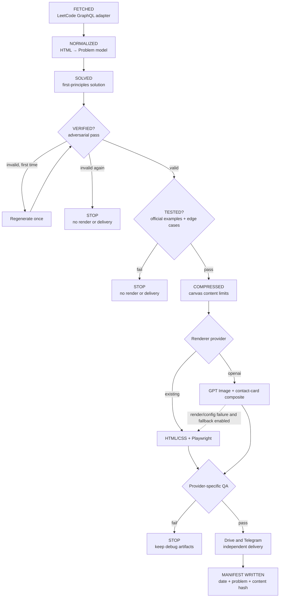
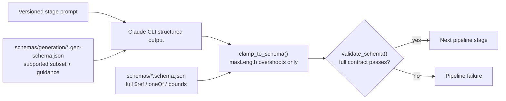
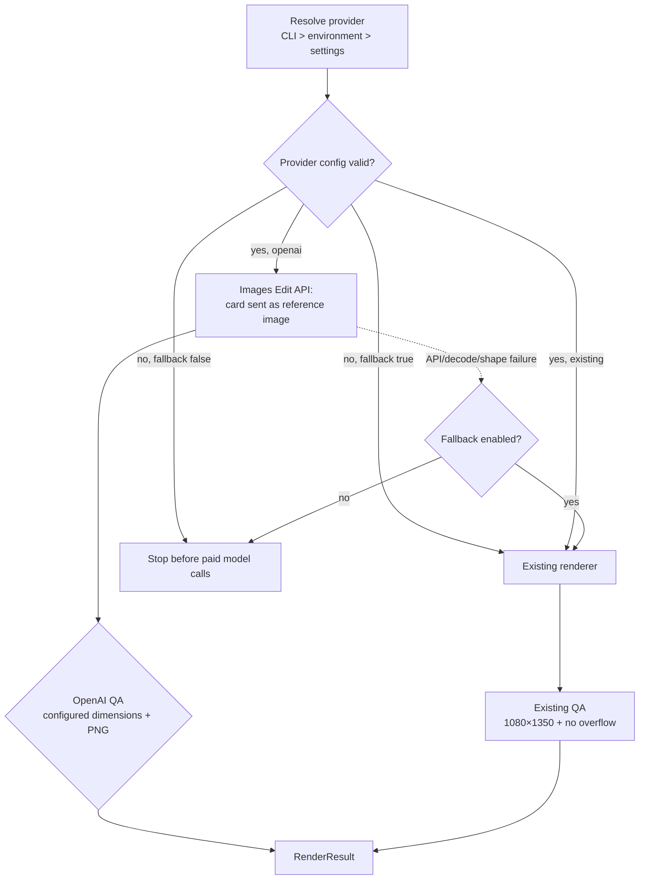
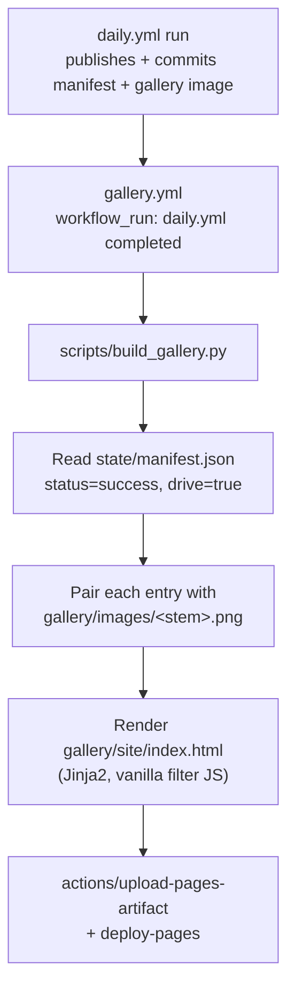
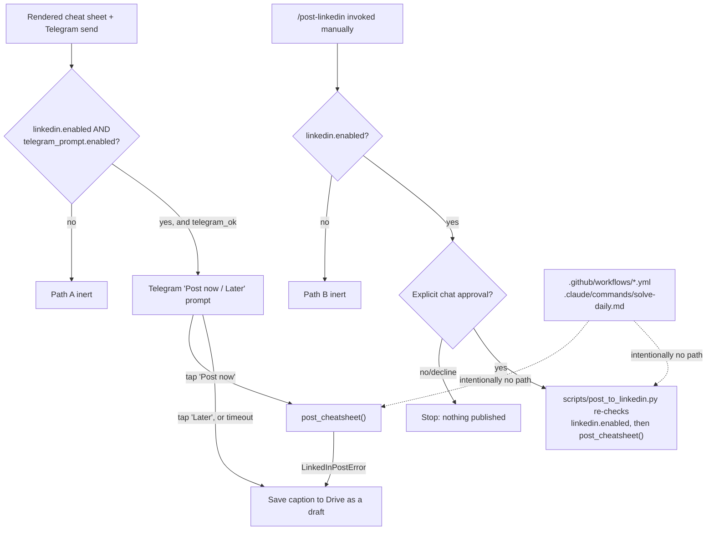

# Architecture

## Pipeline overview



The diagram shows control flow; the stage implementations and contracts are:

- `src/leetcode/client.py` and `parser.py` fetch and normalize into the
  Pydantic `Problem` model.
- `src/claude/runner.py`, the versioned prompts, and
  `src/claude/validator.py` solve, verify, execute tests, compress, and
  validate structured output.
- `src/rendering/factory.py` selects the renderer. Each provider owns its
  own dimensions and QA checks.
- `src/storage/` owns external delivery shapes; `src/state/manifest.py`
  makes successful runs idempotent unless `--force` is supplied.

If a stage fails, its intermediate output (the last successfully produced
JSON/image) is kept in `output/<date>/<problem-number>/` for debugging —
nothing is silently discarded.

## Why solve from scratch instead of reading official solutions

LeetCode's own guidance is to attempt a problem independently before
consulting official/community solutions. Feeding Claude someone else's
solution and asking it to paraphrase would defeat the educational purpose
of a "never forget this" cheat sheet and risks reproducing copyrighted
write-ups. The pipeline only ever gives Claude the problem statement,
constraints, and examples — never a scraped solution.

## Why `--bare` in production

`claude -p --bare` skips auto-discovery of hooks, skills, plugins, MCP
servers, and CLAUDE.md, and forces API-key authentication instead of a
local login session. That means:

- A run behaves identically on any machine (a laptop, a GitHub Actions
  runner, a teammate's machine) because it can't accidentally pick up local
  configuration.
- Production prompts are fully specified by the files in `prompts/claude/`
  passed on the command line — nothing implicit.
- It starts faster and uses fewer tokens, since it isn't loading unrelated
  project context on every call.

CLAUDE.md still matters — it's what loads when you run interactive `claude`
sessions in this repo for development (see docs/OPERATIONS.md).

## Why the prompts explicitly say "no tool access"

`allowed_tools: ""` in `config/settings.yaml` means every `run_stage()`
call is pure reasoning — no Bash, no file access, no code execution. That
is deliberate: correctness is enforced by dedicated deterministic stages
(`src/claude/validator.py`'s `run_examples()` actually executes the
verified solution against every official example; the render QA gate
actually measures overflow), not by letting an LLM call out to check its
own work mid-stage.

In practice, `compress` hit "Reached maximum number of turns (4)" because
the model tried to satisfy `prompts/claude/v1/compress.md`'s hard
line-count limit precisely — twice attempting `Bash` to literally count
lines with `wc -l` / a Python one-liner, both denied since no tools are
allowed, burning through the turn budget on retries instead of just
reading the code and estimating. `prompts/claude/v1/solve.md`,
`verify.md`, and `compress.md` now all state up front that no tools are
available and that counting/verification must happen by inspection, not
execution — and `claude.max_turns` was raised from 4 to 8 as a buffer
against the same failure mode recurring anywhere else, since a few
recovered-from turns cost tokens but a hard stop at max-turns fails the
whole run.

The same root cause shows up in a second-order way: several schema fields
carry a hard `maxLength` (e.g. `reasoning_panel.bullets[i]` at 120 chars,
`headline` at 90) that Claude is expected to respect by estimation, exactly
like the compress line-count limit above. Estimation occasionally overshoots
by a handful of characters — a real solve run failed schema validation with
`reasoning_panel -> bullets -> 1: '...' is too long` at 124/120 chars. Since
there is no tool access to recount and self-correct, and discarding a whole
(paid) generation over a 4-character overshoot is wasteful, `src/claude/
validator.py`'s `clamp_to_schema()` runs between `run_stage()` and
`validate_schema()` on solve/verify/compress output: it walks the same
`$ref`/`$defs`/`oneOf` structure the real schema uses and truncates (with a
trailing `…`) any string that overshoots its `maxLength`, logging a warning
for each field it touches. Everything else — `enum`, `const`, `required`,
`minLength`, item-count bounds — still reaches `validate_schema()`
untouched, since those indicate a genuine shape/reasoning problem rather
than a length overshoot and should still fail the run.

The original design (see the ChatGPT conversation this repo grew out of)
proposed using an OpenAI image model to generate the schematic illustration
and only overlaying deterministic text/code on top. That stayed cut for v1,
even after the visual redesign described below, for three reasons:

1. **Cost.** Every daily run would call a paid image API in addition to
   Claude. A fully deterministic renderer has zero marginal image-gen cost.
2. **Reliability.** Image models are not a reliable source of truth for
   exact code, numbers, or complexity notation — exactly the content a
   "cheat sheet" cannot get wrong.
3. **Reproducibility.** A deterministic renderer produces the same output
   for the same input every time, which matters for debugging and for
   `--force` re-runs.

These reasons made `existing` the original default, and it remains the
recommended provider whenever exact text/code/formulas or byte-for-byte
repeatability matter more than visual style. The richer, diagram-heavy
visual style (array cells with pointer arrows, valid/invalid comparison
panels, a "why this works" reasoning callout) is achieved without an image
model — see "Diagram component library" below.

The `openai` provider (see "Optional OpenAI image renderer" below) is now
`image_generation.provider`'s configured *default*, for GPT Image's
full-card generation. Selecting it means accepting non-deterministic,
possibly-misrendered text in exchange for a different visual style — reasons
2 and 3 above still apply and still matter, which is why
`image_generation.fallback_to_existing` defaults to `true`: an `openai`
config or render failure is silently (but loudly logged) substituted with
the deterministic `existing` renderer rather than failing the run.

## Why HTML/CSS instead of Pillow

v1 rendered directly with Pillow: hand-rolled text wrapping, paragraph
fitting, and a line-based Python syntax highlighter, all drawing onto a
canvas with pixel-coordinate math. That was replaced with an HTML/CSS
template (`src/rendering/templates/cheatsheet.html.jinja2`) rendered by
headless Chromium via Playwright (`src/rendering/render.py`), once the
visual bar moved from "clean and legible" to matching a richer reference
design (gradient headline, icon-circle section badges, colored diagram
cells with pointer arrows, a two-panel valid/invalid comparison, a purple
reasoning panel, syntax-highlighted code). Reasons for the switch:

1. **Layout engine reuse.** Flexbox handles two-column rows, equal-height
   card matching, text wrapping, and overflow measurement for free — the
   Pillow renderer reimplemented all of that by hand (see the historical
   line-spacing/overflow bugs in git history before this pivot).
2. **Still fully deterministic and offline.** The page is one
   self-contained HTML string — fonts and the contact-card image are
   embedded as base64 `data:` URIs at render time (`_data_uri()` in
   `render.py`), so nothing is fetched over the network and output is
   reproducible byte-for-byte given the same input, same as the Pillow
   renderer's guarantee.
3. **Same QA contract.** `render_cheatsheet()` still returns the
   `QAResult` dataclass (`passed`, `width`, `height`, `format`, `checks`,
   `warnings`, `failed_checks`) `src/main.py` already expects — overflow is
   detected via `scrollHeight` against the fixed 1080x1350 viewport instead
   of a Pillow line-fit loop, but it's the same "stop, never silently
   resize or clip" policy.

## Diagram component library

`schemas/cheatsheet.schema.json` and `schemas/solve.schema.json` define an
optional `diagrams` array (0-2 items) and an optional `reasoning_panel`.
Claude (`prompts/claude/v1/solve.md`, "Diagram library" section) decides
per-problem whether a diagram genuinely clarifies the solution — most
array/string/two-pointer/sliding-window problems do; most pure-math or
bit-manipulation problems don't — and never invents one that doesn't fit.

Two components, each with a corresponding Jinja2 partial in
`src/rendering/templates/`:

- **`array_pointers`** (`_array_pointers.html.jinja2`) — one row of cells
  with optional pointer labels, for two pointers / sliding window / prefix
  sums / string scanning.
- **`comparison_states`** (`_comparison_states.html.jinja2`) — 2-3
  side-by-side cases (e.g. valid vs. invalid), each with its own optional
  mini array. This is the component the "Non-Shrinking Sliding Window"
  reference card's design was built around.

Both share a `cell_row` Jinja2 macro (`_macros.html.jinja2`) so cell/pointer
markup stays identical wherever it's used. `reasoning_panel`
(`_reasoning_panel.html.jinja2`) is a short "why this works" callout,
independent of which diagram (if any) is present.

When a cheat sheet has no `diagrams` and no `reasoning_panel` — a
legitimate, expected case for problems where neither adds clarity — the
template falls back to a single-column layout with a compact `Example:`
line instead of leaving empty space or forcing a diagram to fit
(`tests/fixtures/sample_cheatsheet_no_diagram.json` exercises this path).

## Why two schema files per stage



The generation schema constrains what the model can emit; the full schema is
the authoritative boundary between stages. It is never replaced by the
simplified generation schema.

Each of `solve` and `compress` has two schema files: `schemas/solve.schema.json`
/ `schemas/cheatsheet.schema.json` (the real, fully-expressive contract —
`$ref`/`$defs` for the shared `cell`/`pointerLabel` shapes, `oneOf` +
`const` to discriminate `array_pointers` vs. `comparison_states`, exact
`minLength`/`maxLength`/`minItems`/`maxItems` bounds) and a second,
deliberately simpler twin under `schemas/generation/` (`solve.gen-schema.json`
/ `cheatsheet.gen-schema.json`).

The split exists because these two files are consumed by two different
things with different levels of JSON Schema support:

- **`src/claude/runner.py`'s `--json-schema` flag** feeds the schema into
  `claude`'s structured-output/tool-call mechanism, which only supports a
  subset of JSON Schema (`type`, `properties`, `required`,
  `additionalProperties`, `enum`, `const`, `items`, and `type` arrays for
  nullable fields — the last two count toward a union-type complexity
  budget). `oneOf`/`anyOf`/`allOf` are explicitly unsupported at the top
  level of a tool's `input_schema` and are not documented as supported
  anywhere else either; `$ref`/`$defs` aren't addressed in Anthropic's
  structured-outputs docs at all. In practice, giving `--json-schema` the
  full `oneOf` + `$ref`-heavy `cheatsheet.schema.json` made the `compress`
  stage exit non-zero with an empty stderr after a real, ~60s API round
  trip — the schema was accepted at parse time (unlike the earlier
  `$schema: .../2020-12` mismatch, which failed instantly) but something in
  validating the model's actual structured response against it crashed
  silently. The official Anthropic SDKs work around exactly this by
  stripping unsupported keywords from the wire schema and validating the
  response against the original schema client-side afterward — the
  `schemas/generation/` split does that same thing explicitly, since the
  `claude` CLI doesn't do it for a caller-supplied `--json-schema`.
- **`src/claude/validator.py`'s `validate_schema()`** runs *after*
  generation, using the Python `jsonschema` library, which has no such
  restrictions — it fully supports `$ref`/`$defs`/`oneOf`/`const`/length
  and count bounds. This is what actually enforces the precise shape
  (`main.py` always validates against the real `schemas/*.schema.json`,
  never the generation twin).

Practically: `schemas/generation/*.gen-schema.json` replaces `$ref`-shared
definitions with duplicated inline objects, replaces the `oneOf`
discriminated union with one permissive object schema plus an `enum`
discriminator (`component`) and description text explaining which fields
belong to which shape, and replaces every `minLength`/`maxLength`/
`minItems`/`maxItems` with the same bound stated in a `description` instead
— the model treats it as guidance either way, and the real backstops are
`prompts/claude/v1/compress.md`'s hard limits and the render QA gate's
overflow check, not schema-level string-length enforcement. `reasoning_panel`
in the generation schemas is a plain `"type": "object"` (no `null`) for the
same reason nullable `type` arrays are worth avoiding where they're not
needed — the prompts instruct Claude to omit the key entirely rather than
set it to `null` when a diagram or reasoning panel doesn't apply, which the
`(...).get("diagrams") or []` / `.get("reasoning_panel")` call sites in
`src/rendering/render.py` and `src/main.py` already handle identically to
an explicit `null` — see `prompts/claude/v1/solve.md` and `compress.md`.

If you add a field to `cheatsheet.schema.json` or `solve.schema.json`, add
the matching (simplified) field to its `schemas/generation/` twin too, or
`--json-schema` will silently reject/strip it via `additionalProperties:
false` before the model ever gets a chance to populate it.

## Why GitHub Actions, not ChatGPT Scheduled Tasks or n8n

- GitHub Actions gives version-controlled workflow definitions, encrypted
  secrets, per-run logs, manual re-dispatch (`workflow_dispatch`), and free
  minutes for a low-frequency personal job — all in the same repo as the
  code.
- ChatGPT Scheduled Tasks cannot access files inside a ChatGPT Project, so
  prompts/config would have to live somewhere else anyway, and the surface
  is a product UI rather than a reviewable diff.
- n8n (or similar) adds a whole extra hosted service for what is, at its
  core, "run a Python script once a day."

## Why fetch LeetCode directly instead of from a personal solutions repo

The original two-repo design (a DSA solutions repo + a separate automation
repo) added a git-push-triggers-processing step that isn't needed once the
Daily Challenge itself is the trigger. Fetching directly from LeetCode's
GraphQL endpoint removes an entire repository, an entire "did my push
already get processed" state machine, and a coupling to how you personally
organize your solutions repo. The trade-off, documented here on purpose: **LeetCode
does not publish this GraphQL interface as a supported public API.** It is
the same endpoint leetcode.com's own web client uses, is widely relied on by
community tooling, and can change without notice. `src/leetcode/client.py`
isolates every LeetCode-specific assumption behind a small adapter so a
breaking change is a one-file fix, and the pipeline fails loudly (not
silently) if the response shape changes.

## Why OAuth instead of a service account

`src/storage/google_drive.py` originally authenticated as a Google Cloud
service account, on the reasoning that GitHub Actions has no browser to
complete an interactive OAuth consent screen. That reasoning was correct
but incomplete — it missed that a service account has **no Drive storage
quota of its own**. It can create empty folders (metadata only, no bytes),
but the moment it tries to upload actual file content — even into a folder
a real person shared with it as Editor — Google rejects it:

```
403 storageQuotaExceeded: "Service Accounts do not have storage quota.
Leverage shared drives, or use OAuth delegation instead."
```

Shared Drives (the API error's first suggestion) are a Google Workspace
feature and aren't available on a personal/consumer Google account — the
one this pipeline is designed around (see `.env.example`'s
`GOOGLE_DRIVE_FOLDER_ID`, which points into someone's own "My Drive", not
an org's Shared Drive). Domain-wide delegation (a workaround for the same
underlying issue) is also Workspace-admin-only. That leaves OAuth
delegation — authenticating as the actual human Drive account, the same
one that owns the target folder — which works for any Google account and
needs no paid Workspace plan, matching the "minimal cost" constraint this
whole project was built under.

The trade-off: OAuth needs one interactive consent step, which GitHub
Actions genuinely can't do. `scripts/authorize_google_drive.py` runs that
step locally, once, in your own browser (`google_auth_oauthlib`'s
`InstalledAppFlow.run_local_server()`), and prints a refresh token.
Refresh tokens for this OAuth flow don't expire on their own — only if
explicitly revoked (Google Account -> Security -> Third-party access) or
unused for 6+ months — so this is a true one-time step, not a recurring
one, and `src/storage/google_drive.py`'s `_load_credentials()` uses it
completely non-interactively from then on (`google-api-python-client`
refreshes the short-lived access token automatically). See docs/SETUP.md
step 3.

## Daylight saving time

GitHub Actions cron is UTC-only and America/New_York alternates between
UTC-4 (EDT) and UTC-5 (EST). `daily.yml` schedules the job at **both**
13:05 and 14:05 UTC every day; `src/main.py` checks the actual wall-clock
hour in `America/New_York` via `zoneinfo` and no-ops if it isn't the
configured `target_hour` (09:00 by default). Combined with the
idempotency manifest, this guarantees exactly one publish per day
regardless of DST.

## Failure policy

| Stage failure          | Action                                              |
|-------------------------|------------------------------------------------------|
| LeetCode fetch           | Retry (`tenacity`, 3 attempts) -> stop, no artifact  |
| Claude solve              | Retry once -> stop                                   |
| Claude verify (invalid)   | Regenerate solution once, re-verify -> stop if still invalid |
| Example/edge-case tests   | Never publish; stop                                  |
| Renderer / QA gate        | Stop (this is a bug, not a transient failure)        |
| Google Drive upload       | Retry -> stop; manifest marks `drive: false`         |
| Telegram send              | No retry -> continue; manifest marks `telegram: false` |

Drive and Telegram are independent, non-blocking delivery stages: either
one failing marks its own manifest flag `false` and the run still exits
non-zero (so CI surfaces it), but never discards the rendered artifact and
never prevents the other stage from running. The "Renderer / QA gate" row
above covers the `existing` provider's overflow-recovery-then-stop
behavior. The `openai` provider (see "Optional OpenAI image renderer"
below, and now the configured default) is the one exception: a config or
render failure stops the run and records `failure_stage: "render_openai"`
in the manifest only when `image_generation.fallback_to_existing` is
`false`; with the default `true`, the factory (and, for a bad/missing
config caught before any stage runs, `src/main.py`'s pre-flight check)
falls back to the `existing` provider instead of stopping.

## Optional OpenAI image renderer



`image_generation.provider: "openai"` in `config/settings.yaml` (currently
the configured default) switches image generation to GPT Image generating
the *complete* visual cheat sheet, instead of the deterministic HTML/CSS
renderer. This is a deliberate, explicit exception to "Why no AI image
model" above — unlike the smaller-scope idea `prompts/future/openai-diagram.md`
originally sketched (an AI-generated illustration composited *underneath*
deterministic text, kept as an unwired reference), this provider lets GPT
Image render exact code, pseudocode, and complexity as pixels. It exists
because it was explicitly requested as a full alternative renderer, not
because the reliability concerns above stopped applying — they didn't,
which is why `image_generation.fallback_to_existing` defaults to `true`:
selecting `openai` as the default is an informed trade-off that leans on
`existing` as its safety net, not a claim that the reliability concerns
were resolved. Set `image_generation.provider: "existing"` directly (or
pass `--image-provider existing`) to skip GPT Image entirely.

**Contact card handling (v3, current default).** Earlier versions
(v1/v2, see `prompts/openai/README.md`) asked GPT Image to leave an exact
or padded-minimum blank rectangle in a text-to-image request, then
Pillow-composited the untouched `assets/contact-card.png` onto that
rectangle afterward (`src/rendering/card_compositor.py`, since deleted).
That flow depended on GPT Image reliably leaving enough real blank space
near the reserved corner, measured post hoc by scanning pixels
(`detect_blank_region()`); two consecutive live scheduled runs
(2026-08-16 and 2026-08-17) each left only a handful of pixels of blank
space there, tripping the minimum-scale check and falling back to the
`existing` renderer both days — see the `2026-08-16 17:10` and
`2026-08-17 13:56` GitHub Actions run logs (`WARNING
src.rendering.factory: OpenAI renderer failed (Generated background left
only 1x1px of blank space ...)`).

v3 replaces that flow: `assets/contact-card.png` is sent to the Images
Edit API as a reference `image` input alongside the prompt
(`src/rendering/openai_provider.py::_generate_from_reference()`), and
`prompts/openai/v3/cheatsheet.txt`'s CONTACT CARD section asks the model
to draw the card directly into the generated design instead of reserving
space for a later overlay. The prompt gives the model ground-truth
`card_name`/`card_title`/`card_links` text to re-letter verbatim instead
of relying on it to read (and possibly misread) the reference image.
`image_generation.openai.input_fidelity` ("high"|"low") is the Images Edit
API's own parameter for preserving fine reference-image detail (faces,
logos) rather than reinterpreting it, but it's left unset by default: a
live smoke test against the configured model
(`gpt-image-2-2026-04-21`) returned `400
invalid_input_fidelity_model` — "The model ... does not support the
'input_fidelity' parameter" — so `_generate_from_reference()` only
includes it in the API call when explicitly configured, for a model
confirmed to support it. Preserving the photo currently relies on the
CONTACT CARD prompt instructions alone; a second live smoke test
(`scripts/smoke_test_openai.py`, LeetCode #2213 fixture) confirmed the
model reproduced the same photo, pose, and background from the reference
image, correctly re-lettered name/title/all three contact links, and
didn't overlap the card with any generated content. There is no
post-generation pixel measurement or compositing step any more — the
model's own output is the final image, subject only to the same
dimensions/PNG QA gate as before. This trades the old flow's exact-pixel
card guarantee for one that no longer fails outright when GPT Image's
layout leaves no blank corner; `assets/contact-card.png` is still only
ever opened for reading, never written to, by either provider.

**Provider factory (`src/rendering/factory.py`).** The only place that
branches on `image_generation.provider`. `src/main.py` calls
`render_cheatsheet_with_provider()` and nothing else — no provider
conditionals exist anywhere else in the pipeline, the delivery adapters, or
the tests that don't specifically target this feature. Resolution order:
`--image-provider` CLI flag > `IMAGE_GENERATION_PROVIDER` env var >
`config/settings.yaml`'s `image_generation.provider`. `src/main.py`
validates the resolved provider's configuration immediately after loading
settings — before FETCHED, so a broken `openai` config (missing key,
template, or card; invalid size/quality/model) fails before any Anthropic
tokens are spent, not just before the OpenAI request itself.

**`src/rendering/existing_provider.py`** wraps the unmodified
`src/rendering/render.py` renderer plus its overflow-recovery retry (see
"canvas-overflow" in CHANGELOG.md), returning the shared
`src/rendering/base.py::RenderResult` shape.

**`src/rendering/openai_provider.py`** is the actual `openai` provider:

1. Validates config (size/quality/model, `OPENAI_API_KEY`, the prompt
   template file, and the card) *before* any paid request.
2. Builds the prompt (`src/rendering/openai_prompt.py`) from the same
   `schemas/cheatsheet.schema.json` shape the existing renderer consumes —
   no separate normalization layer. Every dynamic field is XML-escaped
   into explicit `<problem_statement>`/`<example>`/`<code>`/etc. tags in
   `prompts/openai/v1/cheatsheet.txt`, and the prompt instructs the model
   to treat that content as untrusted data, not instructions — the
   prompt-injection boundary the content contract requires.
3. Calls the OpenAI Image API (`gpt-image-2-2026-04-21`, `1536x1024`,
   `quality: high` by default), decodes and validates the returned
   base64 PNG, and writes it atomically to
   `output/<date>/<problem>/cheatsheet-openai-background.png`.
4. Retries only `RateLimitError` / `APIConnectionError` /
   `InternalServerError` with the existing `src/utils/retry.py` capped
   backoff helper (reused as-is, no jitter — see that module's docstring).
   Auth/permission/validation errors (`AuthenticationError`,
   `PermissionDeniedError`, `BadRequestError`, `NotFoundError`) never
   retry.
5. Hands off to `src/rendering/card_compositor.py` to overlay the *exact*
   `assets/contact-card.png` — the model is never asked to draw the card.
   Two live smoke tests showed GPT Image does not reliably honor a
   requested reservation size, even a padded one worded as a minimum (see
   CHANGELOG.md for both runs), so the *prompt* request and the *actual
   placement* are handled by two different, independent mechanisms rather
   than one trusted number:
   - **Prompt-side (a nudge, not a guarantee).** The reserved region
     requested in the prompt is sized via
     `card_compositor.compute_reserved_region()`, which pads the card's
     canvas-fit box (`compute_card_box()`) by
     `image_generation.openai.card_reservation_safety_margin` (default
     0.2 / 20%), and `prompts/openai/v2/cheatsheet.txt` states it as a
     minimum ("err on the side of larger"). This alone was insufficient in
     both live tests.
   - **Compositor-side (the actual guarantee).** Before placing the card,
     `card_compositor.detect_blank_region()` scans the *generated*
     background itself near the configured corner and returns the real
     blank rectangle found there (capped at the padded reservation size).
     The card is then fit to *that* measured space (`composite_card()`'s
     `available_width`/`available_height` params), not the requested size.
     If the detected space would force the card below
     `image_generation.openai.card_min_detected_scale` (default 0.4) of
     its native size, compositing fails loudly instead of publishing an
     illegible or overlapping card. Three live smoke tests (see
     CHANGELOG.md) drove the actual algorithm:
     - Height and width are each measured across several probe
       lines, taking the *minimum* extent found, so a genuine content
       intrusion on any one line can only shrink the result, never inflate
       it.
     - A short (`max_gap`, default 4px) non-blank interruption on a probe
       line is tolerated and skipped over if real blank space resumes
       right after it — a card can safely sit over a thin panel-border
       line; only a sustained non-blank run counts as real content.
     - Width is probed only within `min(max_height, detected_height)`, not
       the full requested window — a panel positioned beyond the height
       the card will actually occupy must not zero out width for no real
       reason.
     - The reference "blank" color is the configured `card_clear_hex`,
       deliberately not sampled from the corner pixel itself — if content
       extends all the way into the corner, that pixel is content, not
       background, and self-sampling would silently treat that content's
       color as blank.
     `image_generation.openai.card_margin_right`/`card_margin_bottom`
     (default 45/35, widened from an initial 25/20) also give rounded
     panel corners more room to clear the card's footprint in the first
     place.

   Either way, the compositor still clears the destination rect, preserves
   the card's alpha channel and aspect ratio (proportional downscale only,
   never crop or recolor), clamps placement to the canvas, and writes the
   branded result atomically to `cheatsheet-openai-final.png` — a
   separate, predictable name from the existing renderer's
   `cheatsheet.png`, so neither provider can overwrite the other's output.
   If compositing fails, the background is kept for diagnosis and the
   final file is never written.

**Fallback (`image_generation.fallback_to_existing`, default `true`).**
Two call sites check this flag, both logging a warning and falling back to
the `existing` renderer rather than failing the run: `src/main.py`'s
pre-flight check (`OpenAIConfigError` — missing/invalid config, e.g. no
`OPENAI_API_KEY` — caught before any Anthropic tokens are spent) and the
factory (`OpenAIRenderError` from the actual render/composite call). Set
`false` to make either failure propagate and fail the run loudly instead,
with the reason recorded in `state/manifest.json`. Either way, an `openai`
failure never damages or blocks the `existing` renderer's own path.

**Tests** (`tests/test_openai_renderer.py`, `tests/test_card_compositor.py`,
`tests/test_image_provider_factory.py`) mock the OpenAI client entirely —
no test spends real API credits, matching CLAUDE.md's testing rule.

## Gallery site

`scripts/build_gallery.py` renders every successfully published entry
(`state/manifest.json`, `status: "success"` and `drive: true` — the same
definition `Manifest.already_published()` uses) into a static, framework-
free HTML/CSS gallery, deployed to GitHub Pages by
`.github/workflows/gallery.yml`.



**Where the published PNGs live for the site to read.** `output/<date>/
<problem>/` (where the pipeline actually renders each image) is
gitignored and disposable — regenerated every run, never committed (see
this file's "Pipeline overview" and `state/manifest.py`'s own docstring:
"the manifest is the only piece of state the pipeline persists between
runs"). A publicly deployed static site build still needs *some* durable
copy of each image to read from, so the choice was between two options:

1. **Commit a copy into the repo** (`gallery/images/`, what this project
   does). `src/state/gallery.py::save_gallery_image()` copies the
   QA-passed image there at the same point `src/main.py` records a
   `status="success", drive=True` manifest entry.
2. **Fetch from Google Drive at Pages-build time.** Rejected: it would
   require handing Drive OAuth credentials to a workflow that ends in a
   public deployment (a larger blast radius than the private, human-
   triggered `/post-linkedin` and daily-upload paths those credentials are
   otherwise scoped to — see "LinkedIn posting" below); it would make
   `scripts/build_gallery.py` speak the Drive API shape, which CLAUDE.md
   reserves for `src/storage/` alone ("Nothing outside `src/storage/` may
   know the Drive API shape"); and it would make the gallery build depend
   on live network access and a third-party quota, breaking the
   offline/deterministic build property every other stage in this project
   has (see "Why HTML/CSS instead of Pillow" above).

The trade-off of option 1, stated plainly: the repo grows by roughly one
image per published day (the `existing` renderer's deterministic PNGs run
150-350KB; `openai` renderer output is larger). At one publish/day this is
a few hundred KB/week — trivial for years at this cadence — but it is a
real, unbounded, one-way growth of repo size that would need revisiting
(e.g. Git LFS, or switching to option 2 after all) if the pipeline's
frequency or image size ever changed materially. `gallery/site/` (the
*built* HTML, as opposed to the source images) is gitignored and rebuilt
from scratch on every deploy — same "regenerated every run; do not
version" rule `output/` already follows.

**Tags and difficulty already existed — no schema change needed.**
`schemas/cheatsheet.schema.json`'s `problem.topics` and
`problem.difficulty` were already populated end-to-end before the gallery
existed: LeetCode's own `topicTags` (`src/leetcode/client.py`) flow into
`Problem.topics` (`src/leetcode/models.py`), through
`prompts/claude/v1/solve.md`'s `problem` passthrough, into the compressed
cheat sheet content Claude returns. The gallery only needed to *persist*
that data past a single run — `src/state/manifest.py`'s `ManifestEntry`
gained `title`, `difficulty`, `topics`, `headline`, and `problem_url`
fields (denormalized from `Problem` and the compressed cheatsheet at the
point `src/main.py` records a successful run), since `output/<date>/
<problem>/content.json` is gone by the time `scripts/build_gallery.py`
runs later, same reasoning as the image above. No prompt or schema version
bump was needed (see `prompts/claude/README.md` "Versioning") because
nothing about what Claude is asked to produce changed.

**Filtering is vanilla JS, not pre-rendered per-filter pages.** The
"deterministic over AI" principle this project follows (see "Why HTML/CSS
instead of Pillow" above) is about avoiding model non-determinism in
*content*, not about avoiding client-side script entirely. A small inline
`<script>` in `scripts/templates/gallery.html.jinja2` (no framework, no
external CDN, no build step) toggles card visibility via `data-difficulty`
/`data-topics` attributes, which lets difficulty and topic filters combine
live. The alternative — statically generating one HTML page per
tag/difficulty combination — stays fully script-free but can't combine two
filters at once without a page per combination; vanilla JS was chosen for
that UX reason while keeping the build itself (and the shipped page)
exactly as static and dependency-free as the rest of the site.

**Why a separate `gallery.yml` workflow instead of a step in `daily.yml`.**
`daily.yml` triggers `gallery.yml` via `workflow_run` after a successful
completion (plus `workflow_dispatch` for manual rebuilds, e.g. after a
`--force` backfill). Keeping them separate means a Pages deploy hiccup
(GitHub-side outage, `actions/deploy-pages` failure) never shows up as a
red mark against the daily pipeline job that operations actually cares
about triaging quickly (see "Failure policy" above), and the gallery can
be rebuilt on demand without re-running Claude/Drive/Telegram/LinkedIn.

**Custom domain.** `gallery.custom_domain` in `config/settings.yaml`
(`leetcode.alifouladgar.com`, on the same Cloudflare-managed domain as the
author's portfolio and self-hosted `n8n.alifouladgar.com`) is written into
a `CNAME` file inside `gallery/site/` by every `scripts/build_gallery.py`
run, not just set once via the repo's Pages settings. This is required,
not cosmetic: GitHub Pages' docs state that an Actions-deployed site must
carry the `CNAME` file in the published artifact on *every* deploy, or the
custom domain silently reverts to the default `*.github.io` URL on the
next one (unlike the older git-branch-based Pages flow, where a
`CNAME` file committed once was enough). The DNS side (a `CNAME` record
pointing `leetcode` at `amfooladgar.github.io`, left unproxied/DNS-only in
Cloudflare so GitHub can complete Let's Encrypt domain verification) is
manual, one-time setup outside this repo.

**Tests** (`tests/test_gallery.py`) cover `save_gallery_image()`,
`collect_cards()` (published-only filtering, missing-image skip, stable
sort), `render_site()` (filter attributes present in the rendered HTML),
and a full `build_gallery()` round trip — all offline, no network access,
matching CLAUDE.md's testing rule. `tests/test_state.py` covers the new
`ManifestEntry` fields round-tripping through `save()`/`load()`, including
an old-format entry (written before these fields existed) still loading
with sane defaults.

## Best-effort similar questions

`src/leetcode/client.py` also requests `similarQuestions` on the question
GraphQL type — an unofficial field (like the rest of this endpoint, see
"Why fetch LeetCode directly" above) that returns a JSON-encoded string of
`{title, titleSlug, difficulty}` objects for LeetCode's own "related
problems" list. `_parse_similar_questions()` parses it defensively: a
missing field, empty string, or malformed JSON all degrade to an empty
list rather than raising — this is supplementary data, not something a run
should ever fail over. It flows through `Problem.similar_questions`
(`src/leetcode/models.py`) into the `linkedin_caption` prompt's input, so
`similar_problems` in a drafted LinkedIn caption can be grounded in
LeetCode's own data instead of the model guessing at problem titles it
might get wrong (see "LinkedIn posting" below).

## LinkedIn posting

`src/storage/linkedin.py` publishes the rendered cheat sheet (image +
caption) to a personal LinkedIn profile via the Posts API. Unlike Drive and
Telegram, which are unattended delivery stages that always run once
`--dry-run`/`--skip-drive` don't apply, LinkedIn posting has **two**
entry points, both human-gated, and neither wired into any unattended-only
surface:



- **Path A (automatic, `src/main.py`)** runs immediately after a
  successful Telegram send, only when **both**
  `linkedin.enabled` and `linkedin.telegram_prompt.enabled` are `true`
  (both default `false`). It drafts a caption via the versioned
  `linkedin_caption` stage (`prompts/claude/v1/linkedin_caption.md` ->
  `schemas/linkedin_caption.schema.json`, run through the same
  `run_stage()`/`clamp_to_schema()`/`validate_schema()` pipeline as
  solve/verify/compress), sends it to Telegram, and posts an inline
  "Post now" / "Later" keyboard (`send_linkedin_prompt()`). It then
  long-polls (`await_button_decision()`, bounded by
  `linkedin.telegram_prompt.decision_timeout_seconds`) for a tap. The
  default on **no response is always "save the caption as a Drive draft,"
  never "post"** — a timeout and an explicit "Later" tap take the exact
  same code path. A live post that fails (`LinkedInPostError`) also falls
  back to saving the draft rather than losing the caption. This entire
  block is wrapped in a broad `try/except Exception` so a caption-drafting
  or Telegram-polling failure never flips an otherwise-successful
  Drive+Telegram run's exit code (see "Failure policy" above).
- **Path B (manual, `.claude/commands/post-linkedin.md`)** is a Claude
  Code slash command you invoke yourself, any time after a cheat sheet has
  rendered (including reusing a Path A draft saved earlier that day). It
  shows you the exact caption and image and asks "Post this to LinkedIn
  now?" in the chat — nothing is published until you reply with explicit
  approval. On approval it shells out to `scripts/post_to_linkedin.py`,
  which re-checks `linkedin.enabled` itself before calling
  `post_cheatsheet()`.

**Why this is still safe.** Three independent layers, any one of which
alone would prevent an unattended post:

1. **Config kill switches.** `linkedin.enabled` (both paths) and
   `linkedin.telegram_prompt.enabled` (Path A only) both default `false`
   in `config/settings.yaml`. Nothing posts while either relevant flag is
   off, regardless of what code exists.
2. **A human action is always required, and the default is always
   non-posting.** Path A needs an actual Telegram button tap — its
   *un*answered/timeout branch is "save a draft," not "post," so silence
   or inaction can never result in a publish. Path B needs your typed
   approval in a live chat; declining or staying silent means nothing is
   sent.
3. **No unattended call site.** `post_cheatsheet()` is called from exactly
   two places in this codebase — `src/main.py`'s Path A block (itself
   gated by #1 and #2) and `scripts/post_to_linkedin.py` (Path B, gated by
   #1 and #2, and re-checking `linkedin.enabled` a second time
   independently of the Claude Code command that invokes it). It is never
   called from `.github/workflows/daily.yml`, `.github/workflows/ci.yml`,
   or `.claude/commands/solve-daily.md` — see CLAUDE.md's "Rules" for the
   standing prohibition on adding a third call site.

**Tests** (`tests/test_linkedin.py`,
`tests/test_telegram_linkedin_prompt.py`,
`tests/test_linkedin_caption_format.py`,
`tests/test_post_to_linkedin_script.py`) mock every HTTP call — no test
posts to a real LinkedIn account, matching CLAUDE.md's testing rule.
