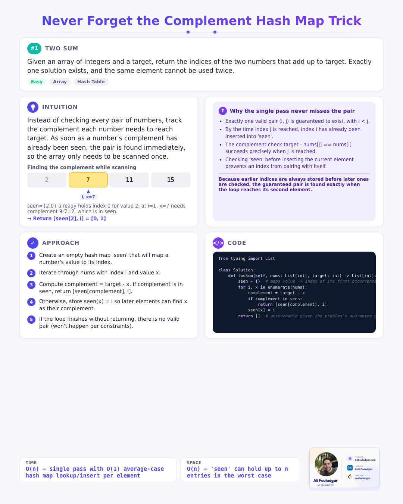
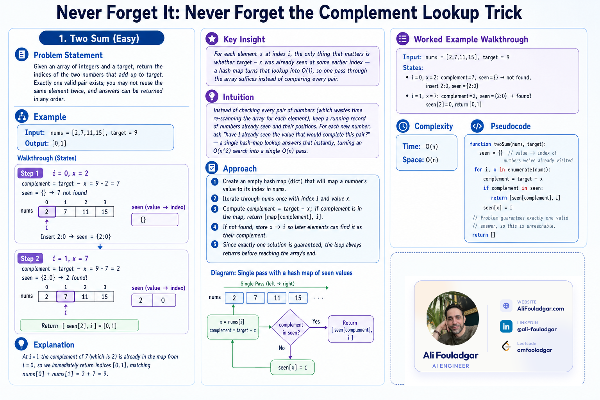
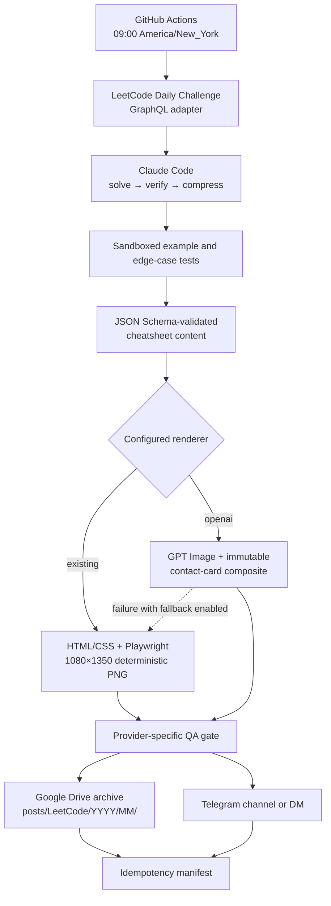

# leetcode-daily-cheatsheet

[](https://github.com/amfooladgar/leetcode-daily-cheatsheet/actions/workflows/ci.yml)
[](https://www.python.org/downloads/)
[](https://github.com/astral-sh/ruff)
[](LICENSE)

An automated end-to-end pipeline that reads each morning's **LeetCode Daily Challenge**, solves and adversarially verifies it using **Claude Code (`claude -p --bare`)**, executes sandboxed example tests, and renders a precise, "never-forget-it" visual cheat sheet (sized for a LinkedIn portrait 4:5 post) archived directly to **Google Drive** and **Telegram**.

---

## Example Output

Two real cheat sheets generated by the pipeline for the same problem, one from each renderer (see [ARCHITECTURE.md](ARCHITECTURE.md#optional-openai-image-renderer) for why both exist and how the fallback between them works):

<table>
<tr>
<td align="center" width="50%">
<b>Deterministic renderer</b><br/>(HTML/CSS + Playwright, <code>image_generation.provider: "existing"</code>)<br/><br/>

</td>
<td align="center" width="50%">
<b>OpenAI renderer</b><br/>(GPT Image + composited contact card, <code>image_generation.provider: "openai"</code>)<br/><br/>

</td>
</tr>
</table>

---

## Visual Pipeline Overview



---

## Core Features & Architecture

- **First-Principles Problem Solving**: Generates solutions strictly from problem statements and constraints — never scrapes or paraphrases copyrighted solution write-ups.
- **Adversarial Verification & Testing**: Performs a two-pass verification for edge cases and time/space complexity, running the generated Python code against official examples in a sandboxed execution context before publishing.
- **Dual-Renderer Architecture**:
  - **HTML/CSS + Playwright (Default & Recommended)**: Fully deterministic, offline-capable 1080x1350 PNG generator using Jinja2 templates, Pygments syntax highlighting, and responsive component diagrams (`array_pointers`, `comparison_states`).
  - **OpenAI GPT-Image (Optional)**: AI-generated visual cards with automatic Pillow-based branding card compositing, blank region scanning (`detect_blank_region`), and non-blocking fallback to the HTML/CSS engine if rendering fails.
- **Idempotency & DST Awareness**: Powered by `state/manifest.json` to prevent duplicate uploads, with dual-cron schedule triggers accommodating Daylight Saving Time (EDT/EST).
- **Multi-Channel Delivery**: Archives formatted assets to Google Drive folders and broadcasts alerts with structured markdown captions to Telegram.
- **LinkedIn posting** — after each cheat sheet, Telegram asks whether to post now or save for later (`/post-linkedin` in Claude Code any time). Off by default (`linkedin.enabled: false`).

---

## Gallery

Every successfully published cheat sheet is also browsable on a static,
filterable gallery site (deployed by `.github/workflows/gallery.yml`,
built by `scripts/build_gallery.py` — see
[ARCHITECTURE.md](ARCHITECTURE.md#gallery-site) for why the images are
committed to the repo and why filtering is a few lines of vanilla JS
instead of a framework):

**[amfooladgar.github.io/leetcode-daily-cheatsheet](https://amfooladgar.github.io/leetcode-daily-cheatsheet/)**

---

## Quick Start

### Prerequisites
- Python 3.12+
- Node/Playwright Chromium dependencies

### Installation & Execution

```bash
# 1. Clone the repository
git clone https://github.com/amfooladgar/leetcode-daily-cheatsheet.git
cd leetcode-daily-cheatsheet

# 2. Set up virtual environment and install dependencies
python3 -m venv .venv
source .venv/bin/activate
pip install -r requirements.txt

# 3. Install Playwright Chromium browser (one-time)
playwright install chromium

# 4. Configure environment variables
cp .env.example .env
# Edit .env with your credentials (ANTHROPIC_API_KEY, GOOGLE_*, etc.)

# 5. Run local dry-run (executes pipeline without uploading)
python -m src.main --dry-run
```

---

## CLI Usage Reference

| Flag | Argument | Description |
|---|---|---|
| `--dry-run` | None | Runs complete pipeline through rendering, skipping Drive upload & manifest updates. |
| `--date` | `YYYY-MM-DD` | Re-run or label pipeline execution for a specific historical date. |
| `--problem-slug` | `SLUG` | Process a specific LeetCode problem (e.g. `two-sum`, `trapping-rain-water`). |
| `--force` | None | Bypass the `state/manifest.json` idempotency guard to force a rerun. |
| `--skip-drive` | None | Render cheat sheet locally but skip Google Drive upload. |
| `--image-provider` | `existing` \| `openai` | Choose renderer provider (`existing` = HTML/CSS, `openai` = GPT Image). |
| `-v`, `--verbose` | None | Enable verbose debug logging output. |

### Command Examples

```bash
# Test a specific problem without uploading
python -m src.main --problem-slug two-sum --dry-run

# Force re-running today's challenge with the OpenAI renderer
python -m src.main --image-provider openai --force

# Run complete test suite and code quality checks
pytest -q
ruff check .
ruff format --check .
```

---

## Environment Variables Matrix

| Variable | Required | Description |
|---|---|---|
| `ANTHROPIC_API_KEY` | **Yes** | Anthropic API key used by `claude -p --bare` for solve, verify, & compress stages. |
| `GOOGLE_OAUTH_CLIENT_ID` | Optional | Google OAuth 2.0 Client ID for Drive archival (see [docs/SETUP.md](docs/SETUP.md)). |
| `GOOGLE_OAUTH_CLIENT_SECRET` | Optional | Google OAuth 2.0 Client Secret for Drive archival. |
| `GOOGLE_OAUTH_REFRESH_TOKEN` | Optional | Google OAuth refresh token generated by `scripts/authorize_google_drive.py`. |
| `GOOGLE_DRIVE_FOLDER_ID` | Optional | Target Google Drive folder ID for storing monthly cheat sheet PNGs. |
| `TELEGRAM_BOT_TOKEN` | Optional | Telegram Bot API token for notification delivery. |
| `TELEGRAM_CHAT_ID` | Optional | Target Telegram Chat / Channel ID. |
| `OPENAI_API_KEY` | Optional | Required only when `image_generation.provider: "openai"` is selected. |

---

## Repository Layout

```text
├── .claude-handoff/     # Agentic build-process artifacts (see note below) — not part of the runtime pipeline
├── .github/workflows/   # CI/CD, daily scheduled run, & gallery deploy Actions
├── assets/              # Branding assets (contact card logo)
├── config/              # Runtime settings (config/settings.yaml)
├── docs/                # Operational and setup documentation
│   ├── SETUP.md         # Step-by-step infrastructure & credentials setup
│   ├── OPERATIONS.md    # Operating runbook, reruns, & troubleshooting
│   └── LINKEDIN_POSTING_SETUP.md # Interactive LinkedIn posting feature spec
├── gallery/             # Public gallery site (see "Gallery" above)
│   ├── images/          # Committed PNG copy per published entry
│   └── site/            # Built by scripts/build_gallery.py — gitignored
├── prompts/             # Versioned Claude Code & OpenAI prompts
├── schemas/             # JSON Schemas enforcing stage input/output shapes
├── scripts/             # Authorization, smoke testing, & gallery-build scripts
├── src/                 # Main Python package implementation
│   ├── claude/          # Claude Code runner, validator, & schema clamper
│   ├── leetcode/        # GraphQL client & problem HTML parser
│   ├── rendering/       # HTML/CSS & OpenAI rendering providers + compositor
│   ├── state/           # Run manifest & idempotency tracking
│   ├── storage/         # Google Drive & Telegram delivery adapters
│   └── main.py          # Orchestration entrypoint
└── tests/               # Unit and integration test suite (100% mocked offline)
```

> **What's `.claude-handoff/`?** It preserves the original implementation-handoff prompts (discovery → implementation → verification → live smoke test → final review) used to build the optional OpenAI (GPT Image) renderer end-to-end with Claude Code, before that work was merged into `src/rendering/`. It's a record of the agentic development process this project was built with, not something the production pipeline reads — safe to ignore if you're just here for the pipeline itself.

---

## Documentation & References

- [ARCHITECTURE.md](ARCHITECTURE.md): Deep-dive into design decisions, schema twins, HTML/CSS Jinja2 rendering, and card detection algorithms.
- [docs/SETUP.md](docs/SETUP.md): One-time setup guide for Anthropic, Google Cloud OAuth, Telegram, and GitHub Secrets.
- [docs/OPERATIONS.md](docs/OPERATIONS.md): Operational runbook for manual triggers, failure policies, and credential rotation.
- [CHANGELOG.md](CHANGELOG.md): Complete project version history following Keep a Changelog standards.

---

## License

This project is open-source under the [MIT License](LICENSE).
