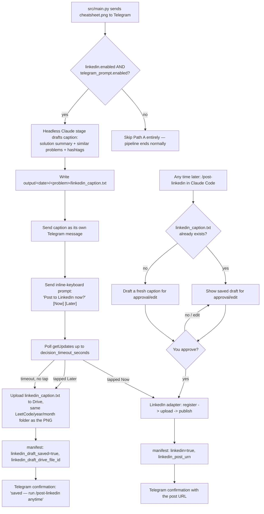

# LinkedIn posting — build spec for Claude Code

This doc is the complete spec for a LinkedIn-posting feature: after a
cheat sheet is rendered, you can ask to review a drafted caption and,
only on your explicit approval, publish the image + caption to your
LinkedIn profile. It is designed to be **built and run in Claude Code**
(not here) because it needs local file access, a one-time OAuth consent
flow in your browser, and `pytest`/`ruff` in the loop.

## Why this is still safe with Path A living inside the unattended pipeline

`src/main.py` runs unattended in GitHub Actions every morning — there is
no human sitting in front of it. The original version of this doc kept
LinkedIn entirely out of `src/main.py` for exactly that reason. Path A
now runs *inside* `src/main.py`, but three layers still make sure nothing
posts without you:

1. **A config kill switch** — `linkedin.enabled: false` in
   `config/settings.yaml` by default. No branch in either path ever
   calls the LinkedIn API while this is `false`.
2. **A second, independent sub-switch for the automatic flow** —
   `linkedin.telegram_prompt.enabled: false` by default. Even once you
   trust the adapter and set `linkedin.enabled: true`, the daily run
   still won't draft a caption or send a prompt until you also flip this
   on. Until then, LinkedIn posting only exists via the manual
   `/post-linkedin` command (Path B).
3. **A human action is still required, every single time, and the
   default is always the safe one.** "Now" only fires because *you*
   tapped a button on your phone within the timeout window. If you don't
   — you're away from your phone, asleep, whatever — the run does not
   guess; it defaults to "later" (save the draft to Drive) and moves on.
   There is no code path where a cheat sheet reaches LinkedIn without an
   explicit tap or an explicit `/post-linkedin` approval.

So the shift from v1 of this doc isn't "less human-in-the-loop," it's
"the human-in-the-loop step moved from a Claude Code chat to a phone
notification" — approval is still mandatory, it's just faster to give.



## How to build it

1. `cd` into this repo and start an interactive Claude Code session
   (plain `claude`, not `claude -p --bare` — this build step is local
   development, so it's fine for it to read `CLAUDE.md`).
2. Paste the entire "Build prompt" section below as your message.
3. Review the diff before committing — in particular: `src/main.py`'s new
   block must be non-blocking on failure (never turns a good Drive+
   Telegram run into a failed one just because the caption stage broke),
   `src/storage/linkedin.py`'s HTTP calls against the API reference notes
   below, and that every new `linkedin.*` / `linkedin.telegram_prompt.*`
   flag defaults to `false`/off in `config/settings.yaml`.
4. Run `pytest -q` and `ruff check .` — both must be green (per
   `CLAUDE.md`'s testing rule, with zero network access).
5. Do the one-time LinkedIn OAuth setup (new `docs/SETUP.md` step 3c,
   which the build prompt adds) to get `LINKEDIN_ACCESS_TOKEN` and
   `LINKEDIN_PERSON_URN`, put them in `.env`, then flip
   `linkedin.enabled: true` when you're ready to allow posting at all,
   and separately `linkedin.telegram_prompt.enabled: true` when you want
   the automatic Telegram prompt in the daily run too.
6. Day to day: either tap the Telegram prompt when it arrives, or run
   `/post-linkedin` in Claude Code whenever — including to fulfill a
   draft you told Telegram to save for "later."

---

## Build prompt (paste this whole section into Claude Code)

> Implement a modular, off-by-default, two-path LinkedIn posting feature
> for this repo, following every convention already established here
> (adapter modules behind `src/storage/`, dataclass results, a dedicated
> `*Error` exception per adapter, lazy `import requests`, mocked-HTTP
> tests, manifest tracking, settings in `config/settings.yaml`, secrets
> only from env vars, versioned prompts under `prompts/claude/v1/` run
> headlessly via `src/claude/runner.py`). Read `CLAUDE.md`,
> `ARCHITECTURE.md`, `src/main.py`, `src/storage/telegram.py`,
> `src/storage/google_drive.py`, `src/state/manifest.py`,
> `src/leetcode/client.py`, `src/leetcode/models.py`,
> `prompts/claude/v1/compress.md`, `schemas/generation/cheatsheet.gen-schema.json`,
> `tests/test_telegram.py`, and `scripts/authorize_google_drive.py` first
> — every new piece here should look like a natural sibling of existing
> code, not a different style.
>
> **Path A runs inside `src/main.py`, but only conditionally and only
> after a human action (a Telegram button tap) or an explicit timeout
> that defaults to the non-posting branch.** Do not add any code path
> that calls `src/storage/linkedin.py`'s `post_cheatsheet()` without
> either (a) `await_button_decision()` having returned `"now"`, or (b)
> the user approving inside `.claude/commands/post-linkedin.md`. Never
> call it from `.github/workflows/daily.yml`, `.github/workflows/ci.yml`,
> or `.claude/commands/solve-daily.md` directly.
>
> ### 1. `config/settings.yaml` — add a new top-level section
>
> ```yaml
> linkedin:
>   enabled: false                    # master kill switch — off by default
>   visibility: "PUBLIC"              # PUBLIC | CONNECTIONS
>   api_version: "202608"             # LinkedIn-Version header (YYYYMM); bump periodically
>   telegram_prompt:
>     enabled: false                  # sub-switch for the automatic Path A flow — off by default
>     decision_timeout_seconds: 300   # how long src/main.py waits for a button tap before defaulting to "later"
>     poll_interval_seconds: 3        # local polling cadence within the timeout window
> ```
> Both `linkedin.enabled` and `linkedin.telegram_prompt.enabled` must be
> `true` for Path A to draft/send/post anything; `linkedin.enabled: true`
> alone only makes Path B (`/post-linkedin`) available.
>
> ### 2. `.env.example` — add a new section (after the Telegram block)
>
> ```
> # --- LinkedIn (Posts API — optional. Path A auto-drafts+prompts via
> # Telegram when linkedin.telegram_prompt.enabled: true; Path B is the
> # manual /post-linkedin Claude Code command. See docs/SETUP.md step
> # 3c). Run `python scripts/authorize_linkedin.py` once after creating a
> # LinkedIn developer app. ---
> LINKEDIN_ACCESS_TOKEN=put-the-access-token-from-authorize_linkedin.py-here
> LINKEDIN_PERSON_URN=urn:li:person:put-your-member-id-here
> ```
>
> ### 3. `src/storage/linkedin.py` — new adapter module (shared by both paths)
>
> Mirror `src/storage/telegram.py`'s shape exactly: module docstring,
> `LinkedInPostError(RuntimeError)`, a `PostResult` dataclass (`post_urn:
> str`, `post_url: str`), a `_load_credentials()` that reads
> `LINKEDIN_ACCESS_TOKEN` / `LINKEDIN_PERSON_URN` from `os.environ` and
> raises `LinkedInPostError` pointing at `docs/SETUP.md` step 3c if
> either is missing, and a public `post_cheatsheet(*, image_path: Path,
> caption: str, visibility: str = "PUBLIC", api_version: str =
> "202608") -> PostResult`.
>
> LinkedIn's current (2026) Posts API flow for an image post to a
> personal profile — implement exactly this, using `requests` (imported
> lazily inside the function):
>
> 1. **Register the image upload.**
>    `POST https://api.linkedin.com/rest/images?action=initializeUpload`
>    with JSON body `{"initializeUploadRequest": {"owner": "<LINKEDIN_PERSON_URN>"}}`
>    and headers `Authorization: Bearer <token>`,
>    `LinkedIn-Version: <api_version>`, `X-Restli-Protocol-Version: 2.0.0`,
>    `Content-Type: application/json`. A `200` response body looks like
>    `{"value": {"uploadUrl": "...", "image": "urn:li:image:..."}}`.
>    Raise `LinkedInPostError` (including the response body) on any
>    non-200 or request exception.
> 2. **Upload the image bytes.** `PUT` the raw bytes of `image_path` to
>    the `uploadUrl` from step 1, with just the `Authorization: Bearer
>    <token>` header. Treat any non-2xx as a `LinkedInPostError`.
> 3. **Create the post.**
>    `POST https://api.linkedin.com/rest/posts` with headers
>    `Authorization: Bearer <token>`, `LinkedIn-Version: <api_version>`,
>    `X-Restli-Protocol-Version: 2.0.0`, `Content-Type: application/json`,
>    body:
>    ```json
>    {
>      "author": "<LINKEDIN_PERSON_URN>",
>      "commentary": "<caption, truncated>",
>      "visibility": "<visibility>",
>      "distribution": {
>        "feedDistribution": "MAIN_FEED",
>        "targetEntities": [],
>        "thirdPartyDistributionChannels": []
>      },
>      "content": { "media": { "id": "<image urn from step 1>" } },
>      "lifecycleState": "PUBLISHED",
>      "isReshareDisabledByAuthor": false
>    }
>    ```
>    A successful response is `201` with the new post's URN in the
>    `x-restli-id` response header (not the body — read
>    `response.headers["x-restli-id"]`). Build
>    `post_url = f"https://www.linkedin.com/feed/update/{post_urn}/"`.
>    Raise `LinkedInPostError` with the response body's error message on
>    any non-201.
>
> Add `_COMMENTARY_MAX_CHARS = 3000` (LinkedIn's post text limit) and a
> `_truncate_caption()` helper identical in spirit to `telegram.py`'s.
> Log the published `post_url` at `info` level on success.
>
> ### 4. `scripts/authorize_linkedin.py` — new one-time OAuth helper
>
> Mirror `scripts/authorize_google_drive.py`'s shape/docstring style, but
> implement LinkedIn's 3-legged OAuth 2.0 authorization-code flow by hand
> (no official LinkedIn Python SDK — stdlib `http.server` for the local
> redirect catcher, plus `requests` and `webbrowser`):
>
> 1. Read `LINKEDIN_CLIENT_ID` / `LINKEDIN_CLIENT_SECRET` from env (via
>    `load_dotenv(REPO_ROOT / ".env")`); setup-only values, add them to
>    the same new LinkedIn `.env.example` block, commented "setup only,
>    not needed by the pipeline itself."
> 2. Start a tiny local HTTP server on `http://localhost:8765/callback`
>    to catch the redirect's `code` query param, then stop.
> 3. Open the browser to:
>    `https://www.linkedin.com/oauth/v2/authorization?response_type=code&client_id=<id>&redirect_uri=http://localhost:8765/callback&scope=openid%20profile%20w_member_social&state=<random>`
>    — verify the returned `state` matches (CSRF check).
> 4. Exchange the `code`:
>    `POST https://www.linkedin.com/oauth/v2/accessToken` as
>    `application/x-www-form-urlencoded` with `grant_type=authorization_code`,
>    `code`, `redirect_uri`, `client_id`, `client_secret` → JSON with
>    `access_token` and `expires_in` (~5,184,000s = 60 days).
> 5. Look up the member's person ID:
>    `GET https://api.linkedin.com/v2/userinfo` with
>    `Authorization: Bearer <access_token>` → JSON has `sub`; person URN
>    is `f"urn:li:person:{sub}"`.
> 6. Print `LINKEDIN_ACCESS_TOKEN=<access_token>` and
>    `LINKEDIN_PERSON_URN=urn:li:person:<sub>` to paste into `.env`, plus
>    a note that the token expires in ~60 days and this script must be
>    re-run to refresh it (no unattended refresh — consistent with both
>    paths requiring a human).
>
> ### 5. `prompts/claude/v1/linkedin_caption.md` — new versioned prompt (headless)
>
> Same style as `prompts/claude/v1/compress.md` (placeholders filled by
> `src/claude/runner.py`, output constrained by `--json-schema`). Inputs:
> `{{problem_json}}` (normalized problem — has `title`, `number`,
> `difficulty`, `topics`, `url`) and `{{cheatsheet_json}}` (the compressed
> content — has `headline`, `key_insight`, `intuition`, `approach`).
> Instruct the model to produce, from **content it can see** (no code, no
> exact numbers it might get wrong):
>
> - `solution_summary`: 1-3 plain-English sentences on the approach/key
>   insight — written for a LinkedIn feed, not a tutorial.
> - `similar_problems`: 0-3 objects `{"title": str, "reason": str}` naming
>   other real LeetCode problems that share the same technique/pattern —
>   **only include ones the model is genuinely confident actually exist
>   on LeetCode by that title; omit entirely rather than invent one.**
>   `reason` is a short phrase, e.g. "same sliding-window technique."
> - `hashtags`: 4-6 strings, each starting with `#`, a mix of generic
>   (`#leetcode`, `#softwareengineering`, `#coding`, `#100DaysOfCode`) and
>   1-2 tailored to `problem_json.topics`.
>
> ### 6. `schemas/linkedin_caption.schema.json` + `schemas/generation/linkedin_caption.gen-schema.json`
>
> Same two-file pattern as every other stage (see
> `schemas/cheatsheet.schema.json` /
> `schemas/generation/cheatsheet.gen-schema.json` and
> `src/claude/validator.py`'s `clamp_to_schema`/`validate_schema`).
> Fields: `solution_summary` (string), `similar_problems` (array, 0-3, of
> `{title, reason}`), `hashtags` (array of strings, 4-6 items). Reuse
> `run_stage()` / `validate_schema()` / `clamp_to_schema()` exactly like
> the `solve`/`verify`/`compress` stages do in `src/main.py` — don't
> write a new Claude-invocation mechanism.
>
> ### 7. `src/leetcode/client.py` / `parser.py` / `models.py` — best-effort similar-questions data
>
> Try adding `similarQuestions` to `_QUESTION_QUERY` in `client.py` (it's
> a JSON-string field on LeetCode's `question` GraphQL type in most
> unofficial API references, listing `{title, titleSlug, difficulty}` —
> **verify this actually works by hand first** — a quick script hitting
> `https://leetcode.com/graphql` with the existing query plus this field
> for a known slug like `two-sum`). If it works: parse the JSON string in
> `parser.py`, add `Problem.similar_questions: list[SimilarQuestion] =
> Field(default_factory=list)` (`SimilarQuestion` = small model with
> `title: str`, `slug: str`, `difficulty: str`) to `models.py`, and pass
> it into the `linkedin_caption` prompt's `problem_json` input so the
> model can *ground* its `similar_problems` output in real data instead
> of guessing. If the field errors, is empty for most problems, or looks
> unreliable, **skip this step entirely** and fall back to the prompt's
> own instruction to only name problems it's confident are real (step 5
> above) — do not block the rest of the feature on this.
>
> ### 8. `src/storage/telegram.py` — extend with prompt/poll functions
>
> Add, alongside the existing `send_cheatsheet()`:
>
> - `send_message(*, text: str, reply_to_message_id: int | None = None) -> SendResult` —
>   plain `POST .../sendMessage` (`chat_id`, `text`, optional
>   `reply_to_message_id`).
> - `send_linkedin_prompt(*, text: str, date: str, problem_number: int, reply_to_message_id: int | None = None) -> SendResult` —
>   `sendMessage` with an inline keyboard:
>   `reply_markup.inline_keyboard = [[{"text": "Post now", "callback_data": f"linkedin_now:{date}:{problem_number}"}, {"text": "Later", "callback_data": f"linkedin_later:{date}:{problem_number}"}]]`.
> - `get_update_offset() -> int` — one `GET .../getUpdates?limit=1&offset=-1`
>   call to find the current highest `update_id`, so polling only reacts
>   to *new* taps (call this before sending the prompt).
> - `await_button_decision(*, since_update_id: int, date: str, problem_number: int, timeout_seconds: int, poll_interval_seconds: int) -> str | None` —
>   long-polls `GET .../getUpdates?offset=<since_update_id + 1>&timeout=<poll_interval_seconds>`
>   in a loop until `timeout_seconds` elapses, looking for a
>   `callback_query` whose `data` is exactly
>   `f"linkedin_now:{date}:{problem_number}"` or
>   `f"linkedin_later:{date}:{problem_number}"` from the configured
>   `TELEGRAM_CHAT_ID`. On a match: call `POST .../answerCallbackQuery`
>   (acknowledge the tap) and `POST .../editMessageReplyMarkup` with an
>   empty keyboard on that message (so the buttons don't stay live),
>   then return `"now"` or `"later"`. On timeout with no match: also
>   clear the keyboard the same way (edit the message so stale buttons
>   from a run nobody answered can't be tapped days later), and return
>   `None`. Ignore callback data for any other date/problem (a stale
>   button from a previous day) — do not treat it as this run's answer.
>
> Reuse `TelegramSendError` for all of these (same failure domain as
> `send_cheatsheet`). Note in `send_linkedin_prompt`'s docstring that
> Telegram *channels* can make inline-button taps behave oddly under
> anonymous-admin mode — recommend using the bot's direct-message chat
> with yourself (the common case per `docs/SETUP.md` step 3b) for this
> specific feature.
>
> ### 9. `src/storage/google_drive.py` — reuse folder logic for the draft
>
> Add `upload_linkedin_draft(*, caption_text: str, filename_stem: str,
> root_folder_id: str, category_folder_name: str, organize_by_year_month:
> bool, year: str, month: str) -> str` (returns the Drive file ID).
> Implement it by calling the module's existing private
> `_build_service()`, `_find_or_create_folder()`, and `_upload_bytes()`
> helpers with the exact same arguments `upload_cheatsheet()` already
> uses to resolve `<root>/<category_folder_name>/<year>/<month>/` —
> **this is what makes "same folder the cheatsheet is saved" literally
> true**, not a re-implementation that could drift. Upload as
> `f"{filename_stem}-linkedin-caption.txt"`, mime type `text/plain`.
>
> ### 10. `src/state/manifest.py` — extend `ManifestEntry`
>
> Add four fields, matching the existing `telegram`/`telegram_message_id`
> pair in style/defaults:
> ```python
> linkedin: bool = False
> linkedin_post_urn: str | None = None
> linkedin_draft_saved: bool = False
> linkedin_draft_drive_file_id: str | None = None
> ```
>
> ### 11. `src/main.py` — wire Path A after the existing TELEGRAM block
>
> Add a new block immediately after the `--- TELEGRAM ---` section,
> guarded by `settings["linkedin"]["enabled"] and
> settings["linkedin"]["telegram_prompt"]["enabled"] and telegram_ok`
> (Path A only makes sense if the photo already sent). Wrap the *entire*
> block in a broad `try/except Exception` that logs a warning and moves
> on — a caption-drafting or Telegram-polling failure here must never
> flip a successful Drive+Telegram run's exit code, same non-blocking
> philosophy as Telegram relative to Drive (see `ARCHITECTURE.md`
> "Failure policy").
>
> 1. Run the new `linkedin_caption` stage via `run_stage()` (same
>    pattern as `_solve`/`_verify`/`_compress`), validate/clamp against
>    `schemas/linkedin_caption.schema.json`.
> 2. Assemble the final caption text with a small pure function
>    `_linkedin_caption(cheatsheet, problem, linkedin_caption_json) -> str`
>    (Python-side template, mirroring `_telegram_caption`'s approach —
>    the model supplies fields, code controls the final shape):
>    ```
>    {headline}
>
>    {solution_summary}
>
>    {similar_problems_line}
>
>    LeetCode #{number} {title} ({difficulty})
>    {url}
>
>    {hashtags_line}
>    ```
>    where `similar_problems_line` is omitted entirely if the list is
>    empty, else something like `"Similar problems worth trying: {title}
>    ({reason}); {title} ({reason})."`, and `hashtags_line` is the
>    hashtags space-joined.
> 3. Write it to `stage_dir / "linkedin_caption.txt"` (plain text) so
>    it's inspectable like every other stage artifact and reusable by
>    `/post-linkedin` later.
> 4. `send_message(text=caption, reply_to_message_id=<the photo message's id>)`.
> 5. `get_update_offset()`, then
>    `send_linkedin_prompt(text="Post this to LinkedIn now, or later?", date=date_str, problem_number=problem.number, reply_to_message_id=<caption message id>)`.
> 6. `await_button_decision(...)` with
>    `settings["linkedin"]["telegram_prompt"]["decision_timeout_seconds"]`
>    / `poll_interval_seconds`.
> 7. Branch:
>    - `"now"`: call `linkedin.post_cheatsheet(image_path=image_path,
>      caption=caption_text, visibility=settings["linkedin"]["visibility"])`
>      inside its own `try/except LinkedInPostError`. On success: set
>      manifest `linkedin=True, linkedin_post_urn=result.post_urn`, then
>      `send_message` a confirmation with `result.post_url`. On failure:
>      `send_message` the error, then **fall through to the Drive-draft
>      save below** (`"later"` branch) as a safety net so a failed live
>      post doesn't lose the draft.
>    - `"later"` or `None` (timeout): call
>      `google_drive.upload_linkedin_draft(...)` reusing the same
>      `category_folder_name`/`organize_by_year_month`/`year`/`month`
>      already computed for the cheatsheet's own Drive upload a few
>      lines above. Set manifest `linkedin_draft_saved=True,
>      linkedin_draft_drive_file_id=<returned id>`. `send_message` a
>      confirmation: "Saved the caption for later — run /post-linkedin in
>      Claude Code anytime to review and publish it."
> 8. Update the single `manifest.record(...)` call already at the bottom
>    of `run()` to include whichever of the four new fields got set
>    (don't add a second `record()` call — keep one manifest write per
>    run, same as today).
>
> Add a short comment noting this block can make the job wait up to
> `decision_timeout_seconds` and that `docs/OPERATIONS.md` documents the
> tradeoff of raising it.
>
> ### 12. `scripts/post_to_linkedin.py` — thin CLI wrapper (used by Path B)
>
> Argparse: `--image`, `--caption-file`, `--date`, `--problem-number`,
> `--visibility` (default from `config/settings.yaml`'s
> `linkedin.visibility`). Behavior: load settings, exit 1 if
> `linkedin.enabled` isn't `true` (second, independent guard beyond what
> `.claude/commands/post-linkedin.md` already checks); call
> `linkedin.post_cheatsheet()`; on success, load the manifest, find the
> existing entry for `--date`/`--problem-number` (error out if not
> found rather than fabricating one), update only `linkedin` /
> `linkedin_post_urn` via `dataclasses.replace()` (don't clobber
> `drive`/`telegram`/`linkedin_draft_saved`/etc.), save, print the
> `post_url`; on `LinkedInPostError`, print the error, exit 1, and leave
> the manifest untouched.
>
> ### 13. Tests
>
> - `tests/test_linkedin.py`: mirror `tests/test_telegram.py` exactly —
>   missing credentials raise naming both env vars; a full mocked
>   `initializeUpload` → `PUT` → `create post` flow returns the right
>   `PostResult` and the create-post call's JSON body has the right
>   `author`/`commentary`/`content.media.id`/`visibility`; non-200/non-
>   2xx/non-201 at each step raises `LinkedInPostError` with the API's
>   message included; caption truncated to 3000 chars.
> - Extend `tests/test_telegram.py` (or a new
>   `tests/test_telegram_linkedin_prompt.py`): `send_message`,
>   `send_linkedin_prompt`'s inline-keyboard payload shape,
>   `await_button_decision` matching the right `date`/`problem_number`
>   suffix and ignoring a different one, returning `None` on timeout,
>   and clearing the keyboard via `editMessageReplyMarkup` in both the
>   matched and timeout cases (mock `requests.get`/`requests.post`, zero
>   real network, zero real sleeping — inject/mock the clock or use a
>   near-zero timeout in the test).
> - A small schema round-trip test for `linkedin_caption.schema.json`
>   (same style as whatever already covers `cheatsheet.schema.json`).
> - A unit test for `_linkedin_caption()`'s formatting, including the
>   empty-`similar_problems` case.
> - A test for `scripts/post_to_linkedin.py`'s `linkedin.enabled: false`
>   guard (patch `src.config.load_settings`, assert exit 1 and that
>   `post_cheatsheet` is never called).
>
> Run `pytest -q` — must be fully green with zero network access, per
> `CLAUDE.md`.
>
> ### 14. Docs
>
> - `docs/SETUP.md`: add **"3c. LinkedIn (Posts API — optional)"**, same
>   numbered-steps style as 3b (Telegram): creating an app at
>   https://www.linkedin.com/developers/apps (note it must be associated
>   with a LinkedIn Page, a LinkedIn requirement, not this pipeline's),
>   adding "Share on LinkedIn" + "Sign In with LinkedIn using OpenID
>   Connect" products, adding the `http://localhost:8765/callback`
>   redirect URL, setting `LINKEDIN_CLIENT_ID`/`LINKEDIN_CLIENT_SECRET`
>   (setup-only), running `scripts/authorize_linkedin.py`, saving the
>   printed values into `.env`, then flipping `linkedin.enabled: true`
>   (Path B available) and optionally `linkedin.telegram_prompt.enabled:
>   true` (Path A available too). Note the ~60-day token expiry and that
>   re-running the authorize script is the refresh mechanism.
> - `docs/OPERATIONS.md`: note that with `telegram_prompt.enabled: true`
>   the daily GitHub Actions run can block for up to
>   `decision_timeout_seconds` waiting on a tap, and how to tell from the
>   Action log whether it posted, saved a draft, or timed out.
> - `ARCHITECTURE.md`: replace/update the earlier "LinkedIn posting
>   (manual, human-in-the-loop)" note to describe both paths and the
>   three safety layers from this doc's "Why this is still safe" section
>   — be explicit that Path A does run inside `src/main.py`, gated by two
>   independent flags plus a human tap, and that the default on no
>   response is always "save for later," never "post."
> - `README.md`: one line, e.g. "LinkedIn posting — after each cheat
>   sheet, Telegram asks whether to post now or save for later
>   (`/post-linkedin` in Claude Code any time). Off by default
>   (`linkedin.enabled: false`)."
> - `CLAUDE.md`: replace the earlier blanket "never call it from
>   src/main.py" rule with: "LinkedIn posting has two paths — an
>   automatic Telegram now/later prompt inside `src/main.py` (gated by
>   `linkedin.enabled` AND `linkedin.telegram_prompt.enabled`, both
>   `false` by default, and always defaulting to the non-posting branch
>   on timeout) and the manual `/post-linkedin` Claude Code command
>   (gated by `linkedin.enabled` alone). Never add a code path that posts
>   without one of these two explicit, human-gated entry points."
>
> ### 15. Verify
>
> Run `pytest -q` and `ruff check .`. Both must be clean. Then show me a
> summary of every file created/changed.

---

## `.claude/commands/post-linkedin.md` (create/replace this file verbatim as part of the build)

```markdown
---
description: Review (or draft) a LinkedIn caption for a rendered cheat sheet and, only with explicit approval, publish it
---

This is Path B of the LinkedIn posting feature (see
docs/LINKEDIN_POSTING_SETUP.md) — the on-demand counterpart to the
automatic Telegram now/later prompt (Path A). Use it any time: right
after a render, to fulfill a draft you told Telegram to save "for
later," or to post an older day's cheat sheet.

Optional argument: a date (`YYYY-MM-DD`) or `<date> <problem-number>` to
target an older cheat sheet instead of the most recent one. Default: the
newest entry under `output/`.

## 0. Preconditions

1. Read `config/settings.yaml`. If `linkedin.enabled` is not `true`, stop
   and tell me: "LinkedIn posting is disabled (`linkedin.enabled: false`
   in config/settings.yaml). Set it to `true` once LinkedIn OAuth is set
   up (see docs/SETUP.md step 3c) if you want to post." Do not proceed.
2. If `src/storage/linkedin.py` doesn't exist yet, tell me the feature
   hasn't been built yet (see docs/LINKEDIN_POSTING_SETUP.md) and stop.
3. Resolve the target stage directory: `output/<date>/<problem-number>/`.
   It must contain `cheatsheet.png` — if missing, say so and stop (I
   need to run the pipeline for that date first).
4. Check `state/manifest.json` for that date/problem. If it already has
   `"linkedin": true`, show me the existing `linkedin_post_urn` and ask
   whether I really want to post the same cheat sheet again before
   continuing.

## 1. Get the caption: reuse a saved draft, or draft a fresh one

- If `output/<date>/<problem-number>/linkedin_caption.txt` exists (Path A
  either posted or saved this already), read it and show it to me as-is
  — this is the same caption Telegram would have shown, don't re-derive
  it from scratch.
- Otherwise (Path A never ran for this date, or `linkedin.telegram_prompt.enabled`
  is off), draft one now from `content.json` and `problem.json`:
  - Hook line: the `headline`, rephrased to read naturally as a LinkedIn
    post's first line.
  - 1-3 sentences briefly explaining the solution/key insight in plain
    English — no code, no exact complexity claims you're not looking at.
  - If you can confidently name 1-3 other real LeetCode problems that
    share the same technique/pattern, add one line mentioning them and
    why — skip this line entirely rather than guess at a problem that
    might not exist.
  - One line: "LeetCode #{number} {title} ({difficulty})".
  - The LeetCode problem URL on its own line.
  - 4-6 relevant hashtags on the last line (mix of `#leetcode`,
    `#softwareengineering`, `#coding`, `#100DaysOfCode`, plus 1-2 tied to
    the problem's actual topics).
  - Keep it well under LinkedIn's 3000-character cap — aim for 400-800
    characters total.
  - Confident-but-approachable, first-person tone (this is Ali posting
    his own daily practice) — 0-2 emoji max, no filler.

Show me the full caption text and the path to `cheatsheet.png`. Do not
open or post anything yet.

## 2. Ask for approval

Ask explicitly: "Post this to LinkedIn now?" Wait for my reply.

- If I ask for edits, revise and show it again — don't post until I say
  something unambiguous like "yes", "post it", "go ahead".
- If I decline, stop here. Nothing was posted — a normal, expected
  outcome, not an error.

## 3. Publish (only after explicit approval)

1. Write the approved caption to a temp file.
2. Run:
   ```bash
   python -m scripts.post_to_linkedin \
     --image "output/<date>/<problem-number>/cheatsheet.png" \
     --caption-file <temp caption file> \
     --date <date> \
     --problem-number <problem-number>
   ```
   (re-checks `linkedin.enabled` itself as a second guard, calls
   `src/storage/linkedin.post_cheatsheet()`, updates
   `state/manifest.json`'s `linkedin` / `linkedin_post_urn` fields
   without touching `drive`/`telegram`/`linkedin_draft_saved`/etc., and
   prints the published post URL.)
3. Report the result: on success, share the printed
   `https://www.linkedin.com/feed/update/...` URL. On failure, show the
   `LinkedInPostError` verbatim and confirm the local PNG/draft/manifest
   are unaffected.

## Never do this automatically

Do not add a call to `scripts/post_to_linkedin.py` (or to
`src/storage/linkedin.py`) into `.claude/commands/solve-daily.md` or any
command besides this one. `src/main.py`'s own Path A already has its own
independent, human-gated route to the same adapter — this command must
stay a separate, deliberate action too.
```

## After the build

1. Do the one-time LinkedIn OAuth setup (`docs/SETUP.md` step 3c) to get
   `LINKEDIN_ACCESS_TOKEN` / `LINKEDIN_PERSON_URN` into `.env`.
2. Set `linkedin.enabled: true` when you want posting available at all
   (Path B, `/post-linkedin`). Separately set
   `linkedin.telegram_prompt.enabled: true` when you also want the
   automatic Telegram now/later prompt in the daily run. Leave either
   (or both) `false` any time you want that part fully inert without
   touching code.
3. Day to day: when the Telegram prompt arrives, tap "Post now" or
   "Later" from your phone. If you tap "Later" (or don't answer in time),
   run `/post-linkedin` in Claude Code whenever you're ready — it'll show
   you the exact caption that was already drafted rather than starting
   over.
