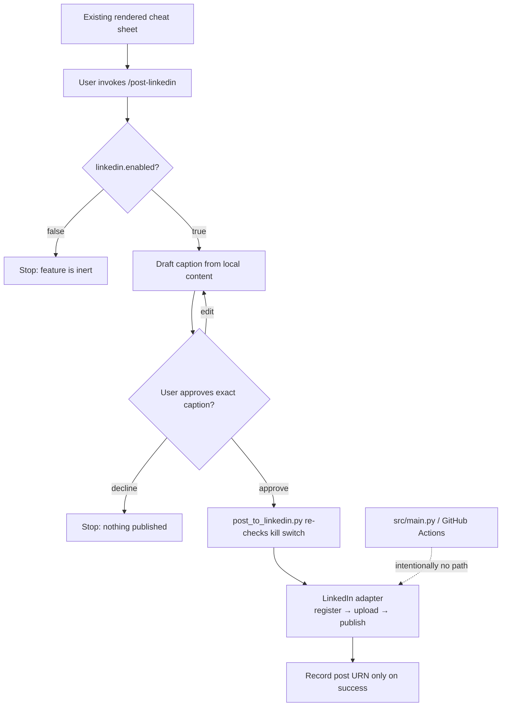

# LinkedIn posting — build spec for Claude Code (superseded)

**This spec has been superseded.** The feature it describes (manual-only
posting via `/post-linkedin`) has been built and extended with a second,
automatic path — see ARCHITECTURE.md "LinkedIn posting" for the current
two-path design (Path A: an automatic Telegram now/later prompt inside
`src/main.py`, gated by `linkedin.enabled` AND
`linkedin.telegram_prompt.enabled`; Path B: this doc's original manual
`/post-linkedin` command, gated by `linkedin.enabled` alone) and
`docs/SETUP.md` step 3c for current setup instructions. The rest of this
file is kept for historical context only — some file/field names below
(e.g. the manifest fields, `.claude/commands/post-linkedin.md`'s exact
content) have since evolved; treat `src/storage/linkedin.py`,
`src/main.py`, and `.claude/commands/post-linkedin.md` as the source of
truth, not this doc.

---

This doc is the original spec for a LinkedIn-posting feature: after a
cheat sheet is rendered, you can ask to review a drafted caption and,
only on your explicit approval, publish the image + caption to your
LinkedIn profile. It is designed to be **built and run in Claude Code**
(not here) because it needs local file access, a one-time OAuth consent
flow in your browser, and `pytest`/`ruff` in the loop.

## Why this is a separate, manual feature (not part of the daily pipeline)

`src/main.py` runs unattended in GitHub Actions every morning — there is
no human there to approve a caption. Auto-posting to a professional
network unattended is exactly the failure mode you asked to avoid
("modular and easy to enable/disable to avoid keep posting them"). So
the design has two independent safety layers:

1. **A config kill switch** — `linkedin.enabled: false` in
   `config/settings.yaml` by default. Nothing posts while it's `false`.
2. **A human-in-the-loop-only entry point** — a new `/post-linkedin`
   Claude Code slash command that always shows you the exact caption and
   asks "Post this to LinkedIn now?" before calling the API. It is never
   wired into `src/main.py`, `.github/workflows/daily.yml`, or any other
   automated command.

Both layers matter independently: the config flag stops it from firing
even if someone adds a call to it later by mistake; the manual-only
command stops it from firing even if `linkedin.enabled` is accidentally
left `true`.



## How to build it

1. `cd` into this repo and start an interactive Claude Code session
   (plain `claude`, not `claude -p --bare` — this build step is local
   development, so it's fine for it to read `CLAUDE.md`).
2. Paste the entire "Build prompt" section below as your message.
3. Review the diff Claude Code produces before committing — in
   particular double-check `src/storage/linkedin.py`'s HTTP calls against
   the API reference notes below, and confirm `linkedin.enabled` defaults
   to `false` in `config/settings.yaml`.
4. Run `pytest -q` and `ruff check .` — both must be green (per
   `CLAUDE.md`'s testing rule, with zero network access).
5. Do the one-time LinkedIn OAuth setup (new `docs/SETUP.md` step 3c,
   which the build prompt adds) to get `LINKEDIN_ACCESS_TOKEN` and
   `LINKEDIN_PERSON_URN`, put them in `.env`, then flip
   `linkedin.enabled: true` in `config/settings.yaml` when you're ready
   to actually post.
6. From then on, use `/post-linkedin` after any day's cheat sheet renders.

---

## Build prompt (paste this whole section into Claude Code)

> Implement a modular, off-by-default LinkedIn posting feature for this
> repo, following every convention already established here (adapter
> modules behind `src/storage/`, dataclass results, a dedicated
> `*Error` exception per adapter, lazy `import requests`, mocked-HTTP
> tests, manifest tracking, settings in `config/settings.yaml`, secrets
> only from env vars). Read `CLAUDE.md`, `ARCHITECTURE.md`,
> `src/storage/telegram.py`, `tests/test_telegram.py`, and
> `scripts/authorize_google_drive.py` first — this feature should look
> and feel like a natural sibling of the Telegram adapter, not a
> different style.
>
> This is a **manual, human-approved** feature, not part of the
> unattended daily pipeline. Do not add any call to it from
> `src/main.py`, `.github/workflows/daily.yml`, `.github/workflows/ci.yml`,
> or `.claude/commands/solve-daily.md`.
>
> ### 1. `config/settings.yaml` — add a new top-level section
>
> ```yaml
> linkedin:
>   enabled: false            # master kill switch — off by default on purpose
>   visibility: "PUBLIC"      # PUBLIC | CONNECTIONS
>   api_version: "202608"     # LinkedIn-Version header (YYYYMM); bump periodically
> ```
>
> ### 2. `.env.example` — add a new section (after the Telegram block)
>
> ```
> # --- LinkedIn (Posts API — optional, manual posting only, see
> # docs/SETUP.md step 3c). Run `python scripts/authorize_linkedin.py`
> # once after creating a LinkedIn developer app. ---
> LINKEDIN_ACCESS_TOKEN=put-the-access-token-from-authorize_linkedin.py-here
> LINKEDIN_PERSON_URN=urn:li:person:put-your-member-id-here
> ```
>
> ### 3. `src/storage/linkedin.py` — new adapter module
>
> Mirror `src/storage/telegram.py`'s shape exactly: module docstring
> explaining what it does and why it's shaped to match
> `google_drive.py`/`telegram.py`, a `LinkedInPostError(RuntimeError)`,
> a `PostResult` dataclass (`post_urn: str`, `post_url: str`), a
> `_load_credentials()` that reads `LINKEDIN_ACCESS_TOKEN` and
> `LINKEDIN_PERSON_URN` from `os.environ` and raises `LinkedInPostError`
> with a clear pointer to `docs/SETUP.md` step 3c if either is missing,
> and a public `post_cheatsheet(*, image_path: Path, caption: str,
> visibility: str = "PUBLIC", api_version: str = "202608") -> PostResult`.
>
> LinkedIn's current (2026) Posts API flow for an image post to a
> personal profile — implement exactly this, using `requests` (imported
> lazily inside the function, same as `telegram.py`):
>
> 1. **Register the image upload.**
>    `POST https://api.linkedin.com/rest/images?action=initializeUpload`
>    with JSON body `{"initializeUploadRequest": {"owner": "<LINKEDIN_PERSON_URN>"}}`
>    and headers `Authorization: Bearer <token>`,
>    `LinkedIn-Version: <api_version>`, `X-Restli-Protocol-Version: 2.0.0`,
>    `Content-Type: application/json`. A `200` response body looks like
>    `{"value": {"uploadUrl": "...", "image": "urn:li:image:..."}}`.
>    Raise `LinkedInPostError` (including the response body) on any
>    non-200 or request exception.
> 2. **Upload the image bytes.** `PUT` the raw bytes of `image_path` to
>    the `uploadUrl` from step 1, with just the `Authorization: Bearer
>    <token>` header (no extra body wrapping — this is a pre-signed
>    upload endpoint, not a JSON API call). Treat any non-2xx as a
>    `LinkedInPostError`.
> 3. **Create the post.**
>    `POST https://api.linkedin.com/rest/posts` with headers
>    `Authorization: Bearer <token>`, `LinkedIn-Version: <api_version>`,
>    `X-Restli-Protocol-Version: 2.0.0`, `Content-Type: application/json`,
>    body:
>    ```json
>    {
>      "author": "<LINKEDIN_PERSON_URN>",
>      "commentary": "<caption, truncated>",
>      "visibility": "<visibility>",
>      "distribution": {
>        "feedDistribution": "MAIN_FEED",
>        "targetEntities": [],
>        "thirdPartyDistributionChannels": []
>      },
>      "content": { "media": { "id": "<image urn from step 1>" } },
>      "lifecycleState": "PUBLISHED",
>      "isReshareDisabledByAuthor": false
>    }
>    ```
>    A successful response is `201` with the new post's URN in the
>    `x-restli-id` response header (not the body — read
>    `response.headers["x-restli-id"]`). Build
>    `post_url = f"https://www.linkedin.com/feed/update/{post_urn}/"`.
>    Raise `LinkedInPostError` with the response body's error message on
>    any non-201.
>
> Add a module constant `_COMMENTARY_MAX_CHARS = 3000` (LinkedIn's post
> text limit) and a `_truncate_caption()` helper identical in spirit to
> `telegram.py`'s, applied to `caption` before sending. Log the
> published `post_url` at `info` level on success, matching
> `telegram.py`'s logging style.
>
> ### 4. `scripts/authorize_linkedin.py` — new one-time OAuth helper
>
> Mirror `scripts/authorize_google_drive.py`'s shape and docstring
> style (what it does, why, how to run it), but implement LinkedIn's
> 3-legged OAuth 2.0 authorization-code flow by hand (there's no
> official LinkedIn Python SDK to lean on — use only the stdlib
> `http.server` for the local redirect catcher, plus `requests` and
> `webbrowser`, both already dependencies):
>
> 1. Read `LINKEDIN_CLIENT_ID` / `LINKEDIN_CLIENT_SECRET` from env (via
>    `load_dotenv(REPO_ROOT / ".env")` same as the Drive script); these
>    are one-time-setup-only values, not needed by the pipeline itself,
>    so don't add them to `.env.example`'s pipeline section — put them
>    in the same new LinkedIn block, commented as "setup only".
> 2. Start a tiny local HTTP server on `http://localhost:8765/callback`
>    (stdlib `http.server.HTTPServer` + a `BaseHTTPRequestHandler`
>    subclass that captures the `code` query param from the redirect,
>    writes a simple "you can close this tab" HTML response, then stops
>    the server).
> 3. Open the browser (`webbrowser.open(...)`) to:
>    `https://www.linkedin.com/oauth/v2/authorization?response_type=code&client_id=<id>&redirect_uri=http://localhost:8765/callback&scope=openid%20profile%20w_member_social&state=<random>`
>    — verify the returned `state` matches before proceeding (CSRF
>    check).
> 4. Exchange the `code` for a token:
>    `POST https://www.linkedin.com/oauth/v2/accessToken` as
>    `application/x-www-form-urlencoded` with `grant_type=authorization_code`,
>    `code`, `redirect_uri`, `client_id`, `client_secret`. Response JSON
>    has `access_token` and `expires_in` (seconds, ~5,184,000 = 60 days).
> 5. Look up the member's own person ID:
>    `GET https://api.linkedin.com/v2/userinfo` with
>    `Authorization: Bearer <access_token>` → JSON has a `sub` field;
>    the person URN is `f"urn:li:person:{sub}"`.
> 6. Print both `LINKEDIN_ACCESS_TOKEN=<access_token>` and
>    `LINKEDIN_PERSON_URN=urn:li:person:<sub>` for the user to paste into
>    `.env`, plus a note that the token expires in ~60 days and this
>    script should be re-run to get a fresh one (there is no unattended
>    refresh — this is consistent with the feature being manual-only).
>
> ### 5. `scripts/post_to_linkedin.py` — new thin CLI wrapper
>
> This is what `.claude/commands/post-linkedin.md` (already exists,
> written for you — read it, don't recreate it) shells out to. Argparse
> flags: `--image` (path), `--caption-file` (path to a text file — avoids
> shell-escaping issues with punctuation/hashtags), `--date`,
> `--problem-number`, `--visibility` (default from
> `config/settings.yaml`'s `linkedin.visibility`).
>
> Behavior:
> 1. Load `config/settings.yaml` via `src.config.load_settings()`. If
>    `linkedin.enabled` is not `true`, print an error and exit 1 — this
>    is the second, independent guard beyond the one
>    `.claude/commands/post-linkedin.md` already checks.
> 2. Call `src.storage.linkedin.post_cheatsheet()` with the image path,
>    the caption file's contents, and `visibility`.
> 3. On success: load `state/manifest.json` via `src.state.manifest`,
>    find the existing entry for `--date`/`--problem-number` (it should
>    already exist from the pipeline run — error out clearly if not
>    found rather than fabricating a new one), update only its
>    `linkedin` and `linkedin_post_urn` fields via
>    `dataclasses.replace()` (don't clobber `drive`/`telegram`/etc.),
>    `manifest.record(...)`, `manifest_mod.save(...)`, then print the
>    published `post_url`.
> 4. On `LinkedInPostError`: print the error and exit 1. Do not touch
>    the manifest — a failed post must not be recorded as a success and
>    must not corrupt the existing entry.
>
> ### 6. `src/state/manifest.py` — extend `ManifestEntry`
>
> Add two fields, matching the existing `telegram`/`telegram_message_id`
> pair exactly in style and defaults:
> ```python
> linkedin: bool = False
> linkedin_post_urn: str | None = None
> ```
>
> ### 7. Tests — `tests/test_linkedin.py`
>
> Mirror `tests/test_telegram.py` exactly (same docstring style, same
> `unittest.mock.patch` approach, zero real network). Cover: missing
> credentials raises `LinkedInPostError` naming both env vars;
> successful flow (mock `requests.post` for both the initializeUpload
> and the create-post calls, and `requests.put` for the image upload)
> returns a `PostResult` with the right `post_urn`/`post_url`, and
> asserts the create-post call's JSON body has the right
> `author`/`commentary`/`content.media.id`/`visibility`; a non-200 on
> initializeUpload raises; a non-2xx on the image PUT raises; a non-201
> on post creation raises with the API's error message included; caption
> is truncated to 3000 chars before being sent. Also add a small test
> for `scripts/post_to_linkedin.py`'s `linkedin.enabled: false` guard
> (patch `src.config.load_settings` to return `enabled: False`, assert
> it exits non-zero and never calls `post_cheatsheet`).
>
> Run `pytest -q tests/test_linkedin.py` and the full `pytest -q` suite
> after — both must pass with zero network access, per `CLAUDE.md`.
>
> ### 8. Docs
>
> - `docs/SETUP.md`: add a new **"3c. LinkedIn (Posts API — optional,
>   manual posting only)"** section, same numbered-steps style as
>   section 3b (Telegram). Cover: creating an app at
>   https://www.linkedin.com/developers/apps (note it must be associated
>   with a LinkedIn Page, even a personal one — that's a LinkedIn
>   requirement, not this pipeline's), adding the "Share on LinkedIn" and
>   "Sign In with LinkedIn using OpenID Connect" products, adding the
>   `http://localhost:8765/callback` redirect URL under the app's Auth
>   tab, setting `LINKEDIN_CLIENT_ID`/`LINKEDIN_CLIENT_SECRET` as env vars
>   (setup-only, not committed), running
>   `python scripts/authorize_linkedin.py`, saving the printed
>   `LINKEDIN_ACCESS_TOKEN`/`LINKEDIN_PERSON_URN` into `.env`, and finally
>   flipping `linkedin.enabled: true` in `config/settings.yaml`. End with
>   a note that the access token expires after ~60 days and
>   `scripts/authorize_linkedin.py` must be re-run to refresh it (no
>   GitHub Actions secret needed since this never runs in CI).
> - `ARCHITECTURE.md`: add a short **"LinkedIn posting (manual,
>   human-in-the-loop)"** section explaining the deliberate deviation
>   from the `--bare`/unattended pattern (see `CLAUDE.md`'s "Why --bare"
>   reference) — this feature intentionally runs through a normal
>   interactive `claude` session via `.claude/commands/post-linkedin.md`
>   precisely so a human reads every caption before it's published, and
>   is gated by `config/settings.yaml`'s `linkedin.enabled` flag as a
>   second, independent safety layer.
> - `README.md`: one line under whatever "features"/"usage" section
>   exists already, e.g. "`/post-linkedin` in Claude Code — draft a
>   caption and, with your approval, publish today's cheat sheet to
>   LinkedIn. Off by default (`linkedin.enabled: false`)."
> - `CLAUDE.md`: add one bullet to the "Rules" section: "LinkedIn
>   posting (`src/storage/linkedin.py`, `.claude/commands/post-linkedin.md`)
>   is manual and human-approved only — never call it from `src/main.py`
>   or any `.github/workflows/*`. It is off by default via
>   `linkedin.enabled: false` in `config/settings.yaml`."
>
> ### 9. Verify
>
> Run `pytest -q` and `ruff check .`. Both must be clean. Then show me a
> summary of every file created/changed.

---

## `.claude/commands/post-linkedin.md` (create this file verbatim as part of the build)

The build prompt above references this file as already written. Create
it at `.claude/commands/post-linkedin.md` with exactly this content:

```markdown
---
description: Draft a LinkedIn caption for a rendered cheat sheet and, only with explicit approval, publish it
---

This command is manual and human-in-the-loop by design — it must never be
called from `.github/workflows/*`, from `src/main.py`'s unattended run, or
chained automatically from `/solve-daily`. It only runs when you invoke
`/post-linkedin` yourself. This is the feature's actual "off switch": even
if `linkedin.enabled: true`, nothing posts without you approving the exact
caption in this conversation first.

Optional argument: a date (`YYYY-MM-DD`) or `<date> <problem-number>` to
post an older cheat sheet instead of the most recent one. Default: the
newest entry under `output/`.

## 0. Preconditions

1. Read `config/settings.yaml`. If `linkedin.enabled` is not `true`, stop
   and tell me: "LinkedIn posting is disabled (`linkedin.enabled: false` in
   config/settings.yaml). Set it to `true` once LinkedIn OAuth is set up
   (see docs/SETUP.md step 3c) if you want to post." Do not proceed.
2. If `src/storage/linkedin.py` doesn't exist yet, tell me to run
   `/build-linkedin-posting`-style setup first (see
   docs/LINKEDIN_POSTING_SETUP.md) and stop.
3. Resolve the target stage directory: `output/<date>/<problem-number>/`.
   It must contain `cheatsheet.png` and `content.json` — if either is
   missing, say so and stop (I need to run the pipeline for that date
   first, e.g. `python -m src.main --dry-run`).
4. Check `state/manifest.json` for that date/problem. If it already has
   `"linkedin": true`, show me the existing `linkedin_post_urn` and ask
   whether I really want to post the same cheat sheet again before
   continuing (avoid accidental duplicate posts).

## 1. Draft the caption

Read `content.json` (the compressed cheatsheet content — has `headline`,
`key_insight`, `problem.number/title/difficulty`, etc.) and `problem.json`
(has the LeetCode `url`). Write a LinkedIn post caption with this shape:

- Hook line: the `headline`, rephrased if needed so it reads naturally as
  the first line of a LinkedIn post (this is the only line visible before
  "...see more").
- 2-4 short sentences: what the problem asks and the key insight/trick
  (`key_insight`, `intuition`) in plain English — no code, no
  implementation detail, written for someone scrolling their feed, not
  someone about to solve it.
- One line noting the problem number, title, and difficulty, e.g.
  "LeetCode #1 Two Sum (Easy)".
- The LeetCode problem URL on its own line.
- 3-6 relevant hashtags on the last line (mix of `#leetcode`,
  `#softwareengineering`, `#coding`, `#programming`, `#100DaysOfCode`, and
  1-2 tailored to the problem's actual topics from `problem.json`'s
  `topics` field if present).
- Keep the whole thing well under LinkedIn's 3000-character cap — aim for
  400-800 characters total, since short posts perform better and this is
  a caption for an image, not the full explanation (the image already
  carries the diagram/code).
- Match a confident-but-approachable, first-person tone — this is Ali
  posting his own daily practice, not a corporate account. No emoji spam
  (0-2 emoji max, only if it fits naturally). No "🚀🔥" filler.

Show me the full caption text and the path to `cheatsheet.png` in the
chat. Do not open or post anything yet.

## 2. Ask for approval

Ask explicitly: "Post this to LinkedIn now?" Wait for my reply.

- If I ask for edits, revise the caption and show it again — don't post
  until I say something unambiguous like "yes", "post it", "go ahead".
- If I decline, stop here. Nothing was posted. This is a normal, expected
  outcome, not an error.

## 3. Publish (only after explicit approval)

1. Write the approved caption to a temp file (avoids shell-escaping a
   multi-paragraph string with hashtags/punctuation).
2. Run:
   ```bash
   python -m scripts.post_to_linkedin \
     --image "output/<date>/<problem-number>/cheatsheet.png" \
     --caption-file <temp caption file> \
     --date <date> \
     --problem-number <problem-number>
   ```
   (`scripts/post_to_linkedin.py` re-checks `linkedin.enabled` itself as
   a second guard, calls `src/storage/linkedin.post_cheatsheet()`,
   updates `state/manifest.json`'s `linkedin` / `linkedin_post_urn`
   fields for that date+problem without touching its other fields, and
   prints the published post URL.)
3. Report the result: on success, share the printed
   `https://www.linkedin.com/feed/update/...` URL. On failure, show the
   error verbatim (it will be a `LinkedInPostError` with the LinkedIn API's
   own error message) and confirm the local PNG/manifest are unaffected —
   a failed LinkedIn post never deletes or invalidates the rendered
   cheat sheet.

## Never do this automatically

Do not add a call to `scripts/post_to_linkedin.py` (or to
`src/storage/linkedin.py`) into `src/main.py`, `.github/workflows/daily.yml`,
`.claude/commands/solve-daily.md`, or any other command that isn't this
one. The whole point of keeping this in its own manual slash command is
that a bad caption or a wrong day never reaches LinkedIn without you
reading it first.
```

## After the build

1. Do the one-time LinkedIn OAuth setup (new `docs/SETUP.md` step 3c) to
   get `LINKEDIN_ACCESS_TOKEN` / `LINKEDIN_PERSON_URN` into `.env`.
2. Set `linkedin.enabled: true` in `config/settings.yaml` when you
   actually want posting available. Leave it `false` any time you want
   the feature fully inert without touching code (e.g. while traveling,
   or if you just don't feel like posting that day's problem).
3. Day to day: after `/solve-daily` or the real pipeline run renders a
   cheat sheet, run `/post-linkedin` in Claude Code, read the drafted
   caption, and approve or edit it before anything is published.
