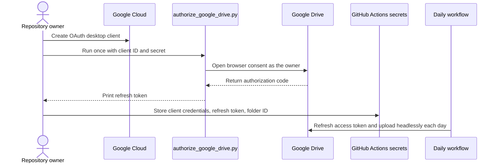
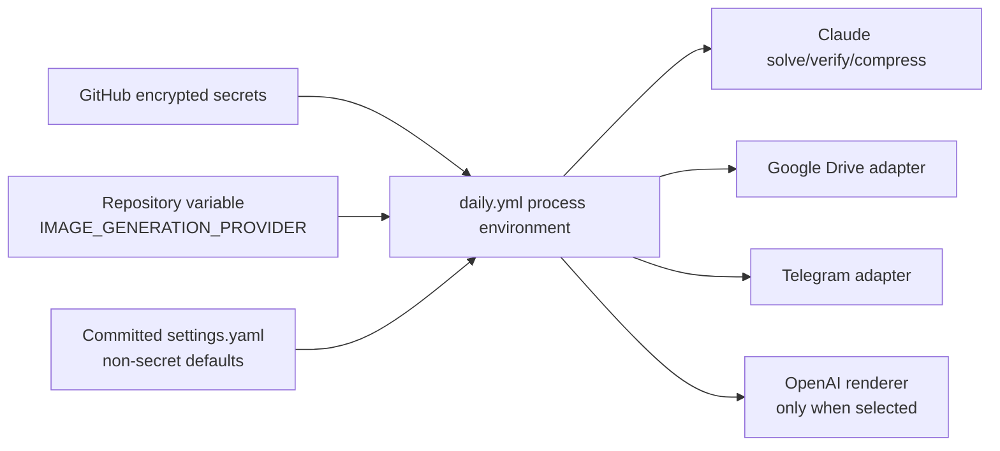

# Setup (one-time)

Do these in order. Each step says exactly what to click/run and which repo
file it corresponds to. Total time: 30-60 minutes, mostly Google Cloud
console clicking.

## 0. Prerequisites

- A GitHub account and the [GitHub CLI](https://cli.github.com) (`gh`) if
  you want to create the repo from the terminal instead of the website.
- [Claude Code](https://code.claude.com) installed locally
  (`curl -fsSL https://claude.ai/install.sh | bash` on macOS/Linux) — used
  for development, not required on the GitHub Actions runner (that installs
  its own copy).
- Python 3.12 locally, for running the pipeline before you trust it in CI.
  After `pip install -r requirements.txt`, also run `playwright install
  chromium` once — the renderer screenshots the cheat sheet with headless
  Chromium (see ARCHITECTURE.md "Why HTML/CSS instead of Pillow").
- A Google account with a Drive folder you're willing to archive into (for
  Drive uploads — you authorize the pipeline as yourself, no service
  account involved; see step 3).

## 1. Create the repository

This scaffold was generated directly in your local folder. From inside it:

```bash
cd leetcode-daily-cheatsheet
git init
git add .
git commit -m "Initial scaffold: architecture, prompts, schemas, pipeline skeleton"
```

Create the empty remote (pick one):

```bash
# Using GitHub CLI (creates + adds remote + pushes in one step)
gh repo create leetcode-daily-cheatsheet --private --source=. --remote=origin --push

# OR: create it manually at https://github.com/new (name: leetcode-daily-cheatsheet,
# visibility: your choice — Private recommended since it will reference your
# personal Drive folder structure), then:
git remote add origin git@github.com:<your-username>/leetcode-daily-cheatsheet.git
git branch -M main
git push -u origin main
```

Recommend **Private**: nothing in the repo is secret (secrets are never
committed — see `.gitignore`), but the repo will contain your daily coding
practice, which you may not want public by default.

## 2. Anthropic API key (Claude Code, headless)

1. Go to the [Claude Console](https://console.anthropic.com) and create an
   API key. This is billed separately from a Claude.ai subscription.
2. Confirm it works locally first:
   ```bash
   export ANTHROPIC_API_KEY=sk-ant-...
   claude --bare -p "reply with OK" --allowedTools ""
   ```
3. You'll add this as a GitHub secret in step 5 — don't put it in any repo
   file. `config/settings.yaml` only names *which model* to use, never a key.

Cost note: each daily run makes 2-3 Claude calls (solve, verify,
compress) against one problem statement — a few thousand tokens per run.
This is the only recurring paid API in the whole pipeline (no image-model
cost — see ARCHITECTURE.md).

## 3. Google Drive (OAuth user credentials — required for unattended uploads)



Only the one-time authorization helper opens a browser. The scheduled workflow
uses the stored refresh token and never needs interactive consent.

This pipeline authenticates to Drive as **you**, via OAuth 2.0, not via a
service account. A service account has no Drive storage quota of its own
and cannot upload file *content* into a personal (non-Google-Workspace)
Drive folder — it can create empty folders, but any actual file upload
fails with `storageQuotaExceeded`. See ARCHITECTURE.md "Why OAuth instead
of a service account" for the full story if you're curious; the short
version is this is the fix, not a workaround.

The interactive OAuth consent screen only needs to happen **once**, on your
own machine — after that, a long-lived refresh token lets GitHub Actions
authenticate headlessly, the same way an API key would.

1. Go to [Google Cloud Console](https://console.cloud.google.com/) and
   create a new project (or reuse one you already have) — e.g.
   `leetcode-cheatsheet`.
2. Enable the **Google Drive API** for that project: APIs & Services ->
   Library -> search "Google Drive API" -> Enable.
3. Configure the OAuth consent screen (APIs & Services -> OAuth consent
   screen) if you haven't already for this project: User Type **External**,
   fill in the required app name/support email, and add yourself as a
   **test user** — this keeps the app unpublished/private, which is fine
   since only you will ever authorize it.
4. Create an OAuth Client ID: APIs & Services -> Credentials -> Create
   Credentials -> OAuth client ID -> Application type **Desktop app**. Name
   it e.g. `leetcode-cheatsheet-cli`. Copy the **Client ID** and **Client
   secret** it shows you.
5. In Google Drive, create the folder structure you want to archive into:
   `posts/LeetCode/`. Open the `LeetCode` folder (or `posts` if you prefer
   the pipeline to create the `LeetCode` subfolder itself — it will, if
   missing) and copy its folder ID from the URL:
   `https://drive.google.com/drive/folders/<THIS_IS_THE_FOLDER_ID>`.
   No sharing step needed — you already own or have access to this folder,
   which is exactly the point of using OAuth instead of a service account.
6. Run the one-time authorization script locally. `GOOGLE_OAUTH_CLIENT_ID`
   / `GOOGLE_OAUTH_CLIENT_SECRET` can either be `export`ed as shown, or (if
   you've already run `cp .env.example .env` per step 0) just set in your
   `.env` file — every entry point in this repo (`src/main.py`,
   `scripts/authorize_google_drive.py`) loads `.env` automatically via
   `python-dotenv`, so a real exported env var always takes priority but
   `.env` is enough on its own:
   ```bash
   pip install google-auth-oauthlib   # one-time, this script only
   export GOOGLE_OAUTH_CLIENT_ID=<client id from step 4>
   export GOOGLE_OAUTH_CLIENT_SECRET=<client secret from step 4>
   python scripts/authorize_google_drive.py
   ```
   A browser window opens; sign in as the Google account from step 5 and
   approve access. The script prints a refresh token — treat it like a
   password, do not commit it.
7. Test locally. Simplest: put all four values into `.env` (client ID,
   client secret, the refresh token step 6 printed, and the folder ID from
   step 5), then just run:
   ```bash
   python -m src.main --problem-slug two-sum --dry-run   # skips Drive
   python -m src.main --problem-slug two-sum --force     # actually uploads
   ```
   Equivalently, without touching `.env`:
   ```bash
   export GOOGLE_OAUTH_CLIENT_ID=<client id from step 4>
   export GOOGLE_OAUTH_CLIENT_SECRET=<client secret from step 4>
   export GOOGLE_OAUTH_REFRESH_TOKEN=<refresh token printed in step 6>
   export GOOGLE_DRIVE_FOLDER_ID=<the folder id from step 5>
   python -m src.main --problem-slug two-sum --dry-run   # skips Drive
   python -m src.main --problem-slug two-sum --force     # actually uploads
   ```

## 3b. Telegram (Bot API — optional, no OAuth)

Delivers the same PNG (plus problem + solution caption) to your own DMs or a
channel. Much lighter than Drive: no OAuth, no service account, just a bot
token as a bearer credential.

1. Open a chat with [`@BotFather`](https://t.me/BotFather) on Telegram and
   send `/newbot`. Follow the prompts (name, username); it replies with a
   token that looks like `123456:ABC-...`. This is `TELEGRAM_BOT_TOKEN`.
2. Get a chat ID:
   - **Your own DMs**: send any message to your new bot, then visit
     `https://api.telegram.org/bot<TOKEN>/getUpdates` in a browser and read
     `result[0].message.chat.id` from the JSON.
   - **A channel**: add the bot as an admin of the channel, post any
     message, then hit the same `getUpdates` URL — the channel's ID looks
     like `-1001234567890`.
3. Test locally (put both values in `.env`, or `export` them):
   ```bash
   export TELEGRAM_BOT_TOKEN=<token from step 1>
   export TELEGRAM_CHAT_ID=<chat id from step 2>
   python -m src.main --problem-slug two-sum --force   # sends to Telegram too
   ```
4. Set `telegram.enabled: false` in `config/settings.yaml` if you only want
   the Drive archive and not the Telegram send — a disabled Telegram stage
   is a no-op, not a failure.

## 3d. OpenAI image renderer (optional, off by default)

Skip this section unless you specifically want GPT Image to generate the
whole cheat sheet instead of the default deterministic HTML/CSS renderer —
see ARCHITECTURE.md "Optional OpenAI image renderer" for what that
actually changes (different canvas size, non-deterministic text/code
rendering) before enabling it.

1. Create an API key at the [OpenAI Platform](https://platform.openai.com/api-keys).
   This is billed per image and is separate from any ChatGPT subscription —
   check current GPT Image pricing before enabling this for daily runs.
2. Confirm it works locally. Either run the full pipeline against a real
   problem:
   ```bash
   export OPENAI_API_KEY=sk-...
   python -m src.main --problem-slug two-sum --dry-run --image-provider openai
   ```
   or, for a faster/cheaper single-image check that doesn't need
   Anthropic credentials or a real LeetCode problem at all, use
   `scripts/smoke_test_openai.py` (a small built-in fixture, `quality`
   defaults to `medium`, makes exactly one billed request per run):
   ```bash
   export OPENAI_API_KEY=sk-...
   python scripts/smoke_test_openai.py
   ```
   Either way, check `output/<date-or-smoke-test>/<problem>/
   cheatsheet-openai-background.png` and `cheatsheet-openai-final.png` —
   the latter is the branded image that would be uploaded/sent.
3. Put `OPENAI_API_KEY=sk-...` in your local `.env` for day-to-day local
   use (see `.env.example`).
4. To use it by default for every run instead of passing `--image-provider
   openai` each time, set `image_generation.provider: "openai"` in
   `config/settings.yaml` — or leave the config on `"existing"` and just
   pass `--image-provider openai` / set `IMAGE_GENERATION_PROVIDER=openai`
   per invocation.
5. For GitHub Actions: add `OPENAI_API_KEY` as a repository secret (see
   step 5 below), then either pick "openai" in the `image_provider` input
   when running `daily.yml` manually, or set the repository variable
   `IMAGE_GENERATION_PROVIDER` (Settings -> Secrets and variables ->
   Actions -> Variables) to `openai` if you want the *scheduled* run to use
   it by default too. Leaving the variable unset keeps scheduled runs on
   `existing`.

## 4. Contact card asset

Already done — `assets/contact-card.png` is your LeetCode visit card and is
already wired into the renderer (bottom-right, scaled to
`contact_card.max_width_px` from `config/settings.yaml`, default 210px wide
on the 1080px canvas). The preview render in this repo's setup already
confirmed it fits cleanly. To swap it for a different image later, just
overwrite `assets/contact-card.png` — no code change needed — then run
`python -m src.main --dry-run` and check
`output/<date>/<problem>/cheatsheet.png` to confirm the new one still fits.

## 5. GitHub repository secrets



Secrets supply credentials, the repository variable may select a renderer,
and committed settings provide non-secret defaults. Credentials never flow
back into tracked files.

Repo -> Settings -> Secrets and variables -> Actions -> New repository
secret. Add:

| Secret name | Value |
|---|---|
| `ANTHROPIC_API_KEY` | from step 2 |
| `GOOGLE_OAUTH_CLIENT_ID` | from step 3.4 |
| `GOOGLE_OAUTH_CLIENT_SECRET` | from step 3.4 |
| `GOOGLE_OAUTH_REFRESH_TOKEN` | printed by `scripts/authorize_google_drive.py` in step 3.6 |
| `GOOGLE_DRIVE_FOLDER_ID` | the folder ID from step 3.5 |
| `TELEGRAM_BOT_TOKEN` | from step 3b.1 |
| `TELEGRAM_CHAT_ID` | from step 3b.2 |
| `OPENAI_API_KEY` | from step 3d.1 — only needed if you use the optional OpenAI renderer |

Never put any of these in `config/settings.yaml`, `CLAUDE.md`, `README.md`,
or a committed `.env` — `.gitignore` already blocks `.env` and
`*credentials*.json`, but double-check `git status` before your first
commit if you experimented locally with real keys in the repo folder.

## 6. Enable the schedule

The workflow file `.github/workflows/daily.yml` is already committed with
the correct cron (see ARCHITECTURE.md "Daylight saving time" for why there
are two cron lines). GitHub only runs scheduled workflows on the **default
branch**, and disables a schedule after 60 days of no repository activity
on a public repo — so once you `git push` to `main`, the schedule is live
with no further action.

Verify it's wired correctly without waiting for tomorrow:

1. Repo -> Actions -> "Daily LeetCode Cheat Sheet" -> Run workflow
   (`workflow_dispatch`) -> pick `dry_run: true` -> Run.
2. Watch the run log. It should fetch today's daily challenge, solve,
   verify, render, and skip the Drive upload (dry run).
3. Once that's green, run it again with `dry_run: false` to do a real
   publish and confirm the PNG lands in Drive at
   `posts/LeetCode/<year>/<month>/`.

## 7. (Optional) Connect Claude Code to GitHub for interactive development

This is unrelated to production scheduling — it's for asking Claude, in an
interactive session, to inspect this repo and reason about a change before
you commit it. In Claude Code: `/install-github-app` if you want the
Claude Code GitHub Action (`@claude` mentions on issues/PRs) — not required
for the daily pipeline to run, since `daily.yml` shells out to the `claude`
CLI directly rather than using that Action. See ARCHITECTURE.md if you're
unsure which one applies to you.

## Done

At this point: pushing is optional going forward (the schedule runs from
whatever is on `main`), the pipeline runs unattended at 9am ET, and every
run's outcome is visible in Actions -> workflow runs, plus
`state/manifest.json` on `main` after each successful publish (the workflow
commits the updated manifest back — see `docs/OPERATIONS.md`).
